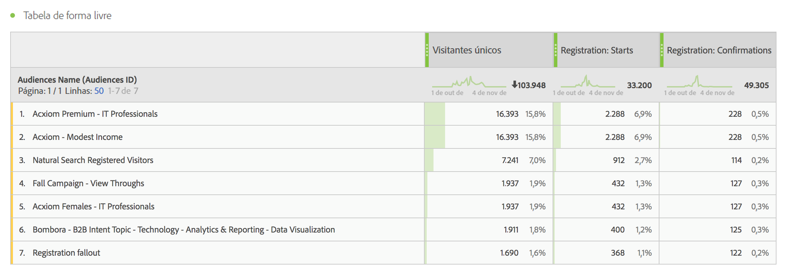
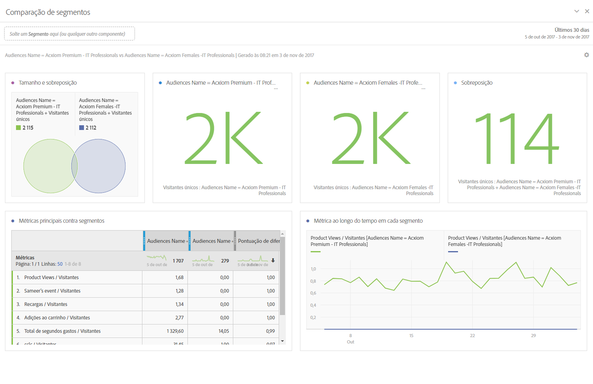
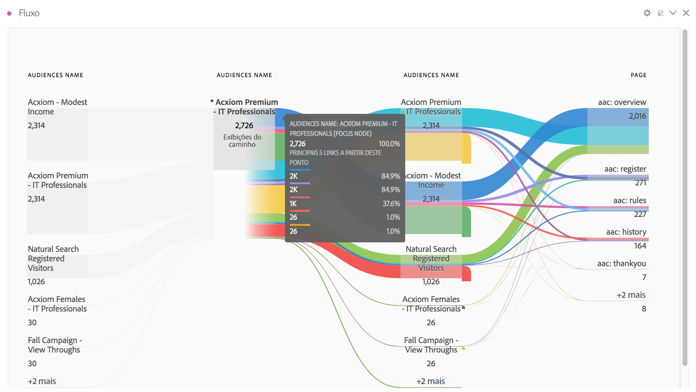
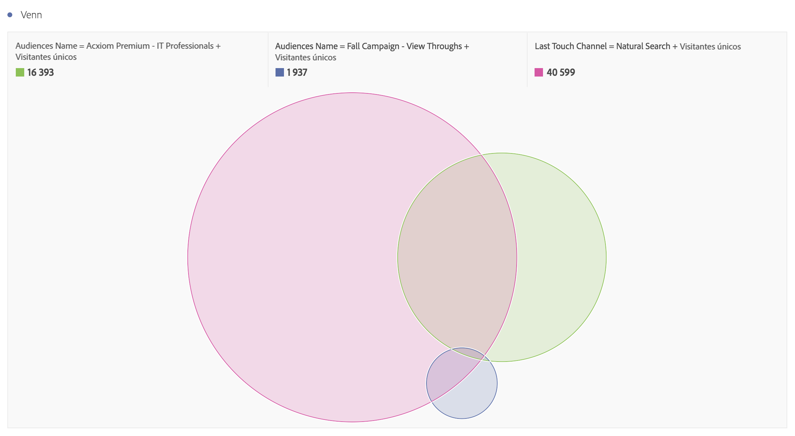
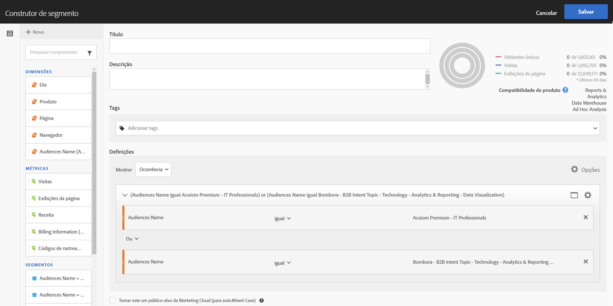
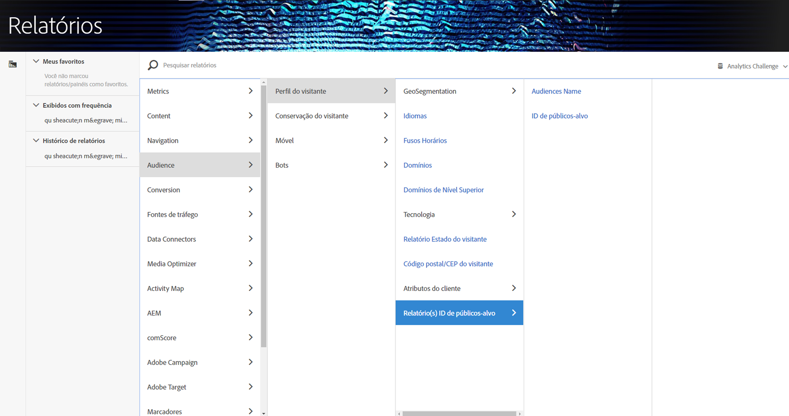

# Usar os dados de público-alvo no Analytics

Você pode usar as dimensões do AAM Audience por todo o Analytics. Os segmentos integrados são as novas dimensões do Analytics, chamadas IDs de públicos-alvo e Nomes de públicos-alvo, e podem se usadas da mesma maneira que qualquer dimensão que o Analytics coleta. Em Feeds de dados, as IDs de públicos-alvo são armazenadas na coluna “mc_audiences”. Essas dimensões não estão disponíveis no Data Workbench ou na Transmissão em tempo real. São exemplos de como as dimensões de Públicos-alvo podem ser aproveitadas:

## Analysis Workspace {#section_C70837499BEA4DED885B3486C9E02C68}

Na Analysis Workspace, os segmentos do AAM aparecem como duas dimensões.

1. Acesse o **[!UICONTROL Espaço de trabalho]**.
1. From the list of **[!UICONTROL Dimensions]**, select the dimensions **[!UICONTROL Audience ID]** or **[!UICONTROL Audience Name]**. Nome é uma classificação amigável da ID.

   

## Comparação de segmentos {#section_E72B80B6470C42D4B9B19BE90E6070A2}

A [Comparação de segmentos](https://marketing.adobe.com/resources/help/en_US/analytics/analysis-workspace/segment-comparison.html) encontra as diferenças estatísticas mais relevantes entre dois segmentos. Dados de Públicos-alvo podem ser usados na Comparação de segmentos de duas maneiras: 1) como os 2 segmentos sendo comparados, e 2) como itens na tabela “Itens de dimensão principais”.

1. Acesse **[!UICONTROL Espaço de trabalho]** e selecione a visualização **Comparação de segmentos]no painel esquerdo.[!UICONTROL **

1. Procure por [!UICONTROL Nomes de público-alvo] no menu de **[!UICONTROL Componentes].**

1. Abra [!UICONTROL Nomes de públicos-alvo] para que itens de dimensão relacionados sejam exibidos.
1. Arraste os públicos-alvo que você deseja comparar para o construtor de Comparação de segmentos.
1. (Opcional): é possível arrastar também outros itens de dimensão ou segmentos; até 2 podem ser comparados.
1. Clique em **[!UICONTROL Construir]**.

   As dimensões IDs e Nomes de públicos-alvo serão exibidas automaticamente na tabela “Itens de dimensão principais”, por serem dados adicionais do perfil referentes aos dois segmentos sendo comparados.

   

## Jornada do cliente (Fluxo) na Analysis Workspace {#section_FC30E5795C9D4539838E30FE11FAEA6E}

Dados de segmento do AAM são passados para o Analytics em uma base ocorrência-por-ocorrência, e representam a associação de público-alvo de um visitante naquele período específico. Ou seja, um visitante pode se encaixar em um segmento (ex. “Percepção”) e depois se classificar para um segmento mais qualificado (ex. “Consideração”). Use [Fluxo](https://marketing.adobe.com/resources/help/en_US/analytics/analysis-workspace/flow.html) na Analysis Workspace para visualizar a jornada feita por um cliente entre públicos-alvo.

1. Acesse **[!UICONTROL Espaço de trabalho]** e selecione a visualização **Fluxo]no painel esquerdo.[!UICONTROL **

1. Arraste a dimensão [!UICONTROL Nome de público-alvo] ao construtor de Fluxo.
1. Clique em **[!UICONTROL Construir]**.
1. (Opcional): arraste qualquer outra dimensão para a visualização de Fluxo para criar um [Fluxo interdimensional](https://marketing.adobe.com/resources/help/en_US/analytics/analysis-workspace/multi-dimensional-flow.html).

Públicos-alvo também podem ser usados em [visualizações de Fallout](https://marketing.adobe.com/resources/help/en_US/analytics/analysis-workspace/fallout_flow.html).

## Visualização de Venn na Analysis Workspace {#section_E78AB764FB5047148B51DC1526B0DF89}

[Visualizações de Venn](https://marketing.adobe.com/resources/help/en_US/analytics/analysis-workspace/venn.html) mostram a sobreposição entre até 3 segmentos.

1. Acesse **[!UICONTROL Espaço de trabalho]** e selecione a visualização **Venn]no painel esquerdo.[!UICONTROL **

1. Procure por [!UICONTROL Nome de público-alvo] no menu de componentes.
1. Abra [!UICONTROL Nome de público-alvo] para que itens de dimensão relacionados sejam exibidos.
1. Arraste os públicos-alvo que você deseja comparar para o construtor de Venn.
1. (Opcional): você pode arrastar também outros itens de dimensão ou segmentos; até 3 podem ser comparados.
1. Clique em **[!UICONTROL Construir]**.

## Construtor de segmentos {#section_2AA81852A1404AB894472CA8959461B6}

É possível incorporar as dimensões de Públicos-alvo no [Construtor de segmentos](https://marketing.adobe.com/resources/help/en_US/analytics/segment/seg_build.html) do Analytics, junto às informações de comportamento coletadas pelo Analytics.

1. Go to  **[!UICONTROL Components]** &gt; **[!UICONTROL Segments]** .
1. Clique em **[!UICONTROL Adicionar]para criar um novo segmento.**
1. Depois de nomear o segmento, arraste a dimensão [!UICONTROL Nome de público-alvo] ao painel Definições.
1. (Opcional): adicione outros critérios ao segmento.
1. Salve o segmento.

   

## Relatórios e análises e Construtor de relatórios {#section_04E8FD30F73344D7937AD3C6CD19E34A}

1. To view the Analytics report, go to  **[!UICONTROL Reports]** &gt; **[!UICONTROL Visitor Profile]** &gt; **[!UICONTROL Audience ID Reports]** .
1. Nessa pasta, é possível acessar as dimensões ID de público-alvo e Nome de público-alvo.

   

