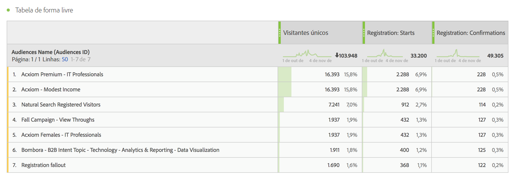
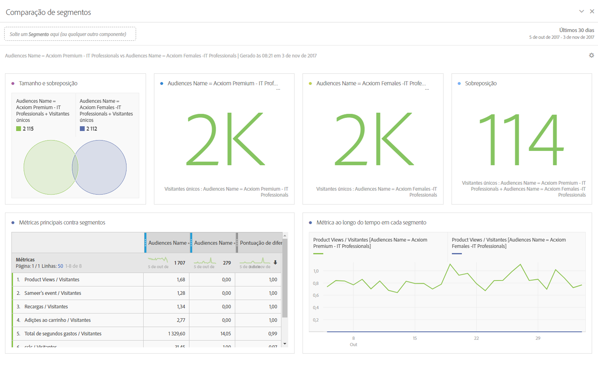
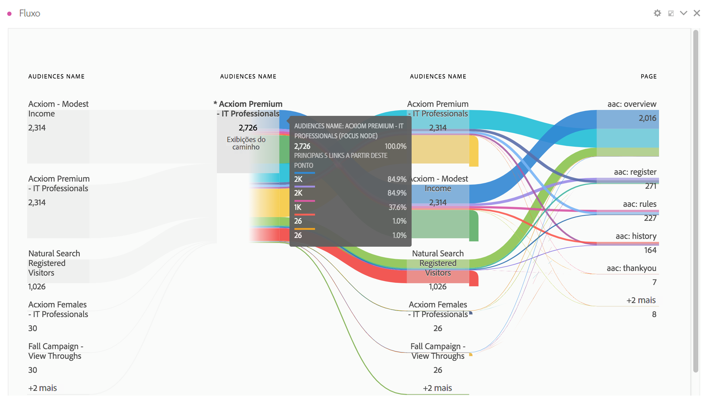
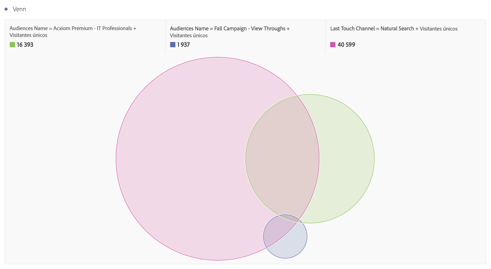
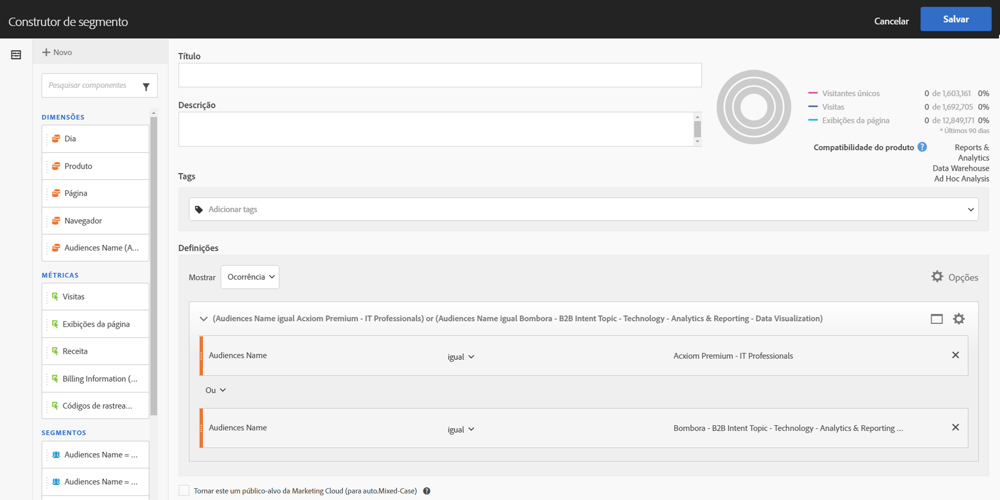

# Usar os dados de público-alvo no Analytics

Você pode usar as dimensões do Adobe Audience Manager Audience em todo o Analytics. Os segmentos integrados são novas dimensões do Analytics chamadas ID de públicos-alvo e Nome de públicos-alvo, e podem ser usados como qualquer outra dimensão coletada pelo Analytics. Em Feeds de dados, as IDs de públicos-alvo são armazenadas na coluna “mc_audiences”. Essas dimensões não estão disponíveis no Data Workbench ou na Transmissão em tempo real. Alguns exemplos de como as dimensões de Públicos-alvo podem ser aproveitadas incluem:

## Analysis Workspace {#workspace}

No Analysis Workspace, os segmentos do Adobe Audience Manager aparecem como duas dimensões.

1. Acesse o **[!UICONTROL Workspace]**.
1. Na lista de **[!UICONTROL Dimensões]**, selecione as dimensões **[!UICONTROL ID de Público-alvo]** ou **[!UICONTROL Nome de Público-alvo]**. O nome é uma classificação amigável da ID.

   

## Comparação de segmentos {#compare}

A [Comparação de segmentos](/help/analyze/analysis-workspace/c-panels/c-segment-comparison/segment-comparison.md) encontra as diferenças estatísticas mais relevantes entre dois segmentos. Dados de Públicos-alvo podem ser usados na Comparação de segmentos de duas maneiras: 1) como os 2 segmentos sendo comparados, e 2) como itens na tabela “Itens de dimensão principais”.

1. Acesse **[!UICONTROL Workspace]** e selecione a visualização **[!UICONTROL Comparação de segmentos]** no painel esquerdo.

1. Pesquise por [!UICONTROL Nome do público-alvo] no menu **[!UICONTROL Componente]**.

1. Abra [!UICONTROL Nomes de públicos-alvo] para que itens de dimensão relacionados sejam exibidos.
1. Arraste os públicos-alvo que você deseja comparar para o Construtor de comparação de segmentos.
1. (Opcional): é possível trazer outros itens ou segmentos de dimensão também, até 2 podem ser comparados.
1. Clique em **[!UICONTROL Criar]**.

   As dimensões IDs e Nomes de públicos-alvo serão exibidas automaticamente na tabela “Itens de dimensão principais”, por serem dados adicionais do perfil referentes aos dois segmentos sendo comparados.

   

## Jornada do cliente (Fluxo) na Analysis Workspace {#flow}

Os dados de segmento do Adobe Audience Manager são passados para o Analytics ocorrência por ocorrência, e representam a associação de público-alvo de um visitante naquele período específico. Ou seja, um visitante pode se encaixar em um segmento (ex. “Percepção”) e depois se classificar para um segmento mais qualificado (ex. “Consideração”). Você pode usar o [Fluxo](/help/analyze/analysis-workspace/visualizations/fallout/fallout-flow.md) no Analysis Workspace para visualizar a jornada que um visitante faz entre os públicos.

1. Acesse **[!UICONTROL Workspace]** e selecione a visualização **[!UICONTROL Fluxo]** no painel esquerdo.

1. Arraste a dimensão [!UICONTROL Nome do público-alvo] para o Construtor de fluxo.
1. Clique em **[!UICONTROL Criar]**.
1. (Opcional): arraste qualquer outra dimensão para a visualização de Fluxo para criar um [Fluxo interdimensional](/help/analyze/analysis-workspace/visualizations/c-flow/multi-dimensional-flow.md).

Públicos-alvo também podem ser usados em [visualizações de Fallout](/help/analyze/analysis-workspace/visualizations/fallout/fallout-flow.md).

## Visualização de Venn na Analysis Workspace {#venn}

[As visualizações de Venn](/help/analyze/analysis-workspace/visualizations/venn.md) mostram a sobreposição entre até três segmentos.

1. Acesse **[!UICONTROL Workspace]** e selecione a visualização **[!UICONTROL Venn]** no painel esquerdo.

1. Procure por [!UICONTROL Nome do público-alvo] no menu de componentes.
1. Abra [!UICONTROL Nome do público-alvo] para que itens de dimensão relacionados sejam exibidos.
1. Arraste os públicos que deseja comparar para o construtor de Venn.
1. (Opcional): também é possível incluir outros itens ou segmentos de dimensão; até 3 podem ser comparados.
1. Clique em **[!UICONTROL Criar]**.

## Construtor de segmentos {#builder}

É possível incorporar as dimensões de Públicos-alvo no [Construtor de segmentos](/help/components/segmentation/segmentation-workflow/seg-build.md) do Analytics, junto às informações de comportamento coletadas pelo Analytics.

1. Acesse **[!UICONTROL Componentes]** > **[!UICONTROL Segmentos]**.
1. Clique em **[!UICONTROL Adicionar]** para criar um novo segmento.
1. Depois de nomear o segmento, arraste a dimensão [!UICONTROL Nome do público-alvo] para o painel Definições.
1. (Opcional): adicione outros critérios ao segmento.
1. Salve o segmento.

   

