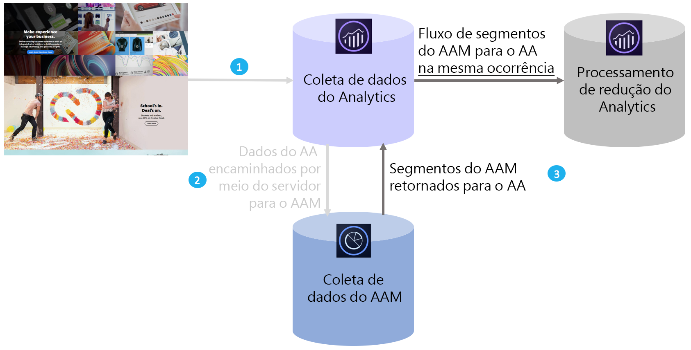

# Visão geral do Audience Analytics

O Adobe Audience Manager (AAM) é uma plataforma avançada de gerenciamento de dados que ajuda você a construir perfis de público-alvo exclusivos a partir da integração de dados primários, secundários/parceiros e de terceiros. Para anunciantes, esses perfis de público-alvo ajudam a definir os segmentos mais valiosos para uso em qualquer canal digital.

Com a integração do Audience Analytics corretamente configurada, é possível incorporar dados de público-alvo do AAM como informações demográficas (ex. gênero ou nível de renda), informações psicográficas (ex. interesses e hobbies), dados CRM e dados de impressão de anúncios a qualquer fluxo de trabalho do Analytics.

## Principais benefícios {#section_94816D17283349E0BA28521BE55BB868}

A integração do Audience Analytics apresenta os seguintes benefícios principais:

* É a primeira integração produzida entre uma Plataforma de gerenciamento de dados (DMP) e um mecanismo de análise no mercado.
* Segmentos são compartilhados do AAM ao Analytics em tempo real, para fornecer informações sobre descoberta de públicos-alvo, segmentação e otimização.
* Todos os segmentos do AAM são compartilhados por padrão, o que enriquece por completo os perfis de clientes no Analytics.
* Administradores de soluções podem habilitar a integração por meio da interface do usuário, sem precisarem fazer muitas alterações no código.
* Somente segmentos aderidos a controles de exportação de dados do Audience Manager são compartilhados.

## Como funciona {#section_CECDF5A0FEC64264B206EFEF54F19EF2}

1. Cada vez que um visitante acessa suas propriedades digitais, ocorrências são coletadas e enviadas ao Analytics.
1. Com [o encaminhamento pelo lado do servidor](/help/admin/admin/c-server-side-forwarding/ssf.md), cada ocorrência recebida pelo Analytics é automaticamente enviada ao AAM em tempo real.
1. Por meio da integração do Audience Analytics, para cada ocorrência, a associação de público-alvo de um visitante é pesquisada no AAM e uma lista de IDs de segmentos é retornada ao Analytics para a execução do processamento em tempo real.

Segmentos do AAM são inseridos quando houver ocorrências semelhantes, portanto você pode ter certeza de que os dados disponíveis no AAM sobre um visitante não serão ignorados e estarão sempre atualizados em relação à ocorrência. Isso é melhor do que um plug-in AppMeasurement, pois o plug-in pode disponibilizar esses segmentos somente na próxima ocorrência (em vez da ocorrência atual).

Além disso, classificamos automaticamente as IDs de segmentos do AAM em relação aos nomes amigáveis, para que você não precise pesquisar IDs alfanuméricas em relatórios do Analytics.

## Pré-requisitos {#section_A345DC31F7D44EAE9DC1AB53E824C0CC}

Verifique se você atende a estes pré-requisitos:

* Você é um cliente do Audience Manager e do Adobe Analytics.
* Você é um administrador do Audience Manager.
* Você está usando o serviço Identity Service v 1.5 ou posterior.
* Conjuntos de relatórios do AAM e do Adobe Analytics são [mapeados para a mesma organização IMS da Experience Cloud](https://marketing.adobe.com/resources/help/en_US/mcloud/report-suite-mapping.html).
* You use [server-side forwarding](/help/admin/admin/c-server-side-forwarding/ssf.md) and have implemented the [Audience Management module](https://marketing.adobe.com/resources/help/en_US/aam/c_profiles_audiences.html) (no DIL code) - AppMeasurement 1.5 or later.

These prerequisites are described in the [Audience Analytics Workflow](../../integrate/c-audience-analytics/c-workflow/audiences-workflow.md#concept_A5F067D14C794B759A1D92526DE27F83).
