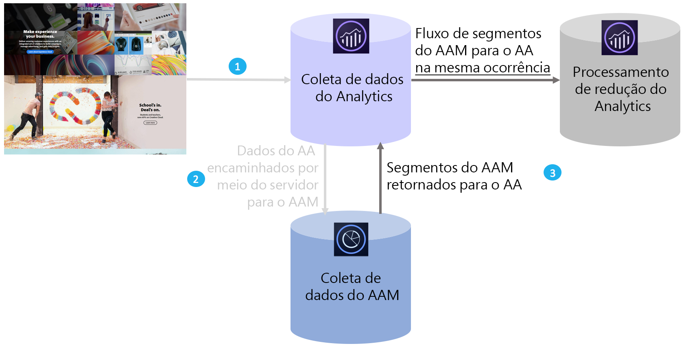

# Visão geral do Audience Analytics

O Adobe Audience Manager (Adobe Audience Manager) é uma plataforma eficiente de gerenciamento de dados que ajuda você a criar perfis de público-alvo exclusivos a partir de integrações de dados primárias, secundárias/de parceiros e de terceiros. Para anunciantes, esses perfis de público-alvo ajudam a definir os segmentos mais valiosos para usar em qualquer canal digital.

Com a integração do Audience Analytics em vigor, é possível incorporar dados de público-alvo do Adobe Audience Manager, como informações demográficas (por exemplo, sexo ou nível de renda), informações psicográficas (interesses e hobbies), dados de CRM e dados de impressão de anúncio, em qualquer fluxo de trabalho do Analytics.

>[!BEGINSHADEBOX]

Assista a  [Audience Analytics](https://experienceleague.adobe.com/pt-br/docs/analytics-learn/tutorials/integrations/audience-manager/audience-analytics-integrate-aam-segments-into-analytics){target="_blank"} para ver um vídeo de demonstração.

>[!ENDSHADEBOX]

## Principais benefícios {#benefits}

A integração do Audience Analytics apresenta os seguintes benefícios principais:

* É a primeira integração produzida entre uma Plataforma de gerenciamento de dados (DMP) e um mecanismo de análise no mercado.
* Os segmentos são compartilhados do Adobe Audience Manager para o Analytics em tempo real, para informar a descoberta, a segmentação e a otimização de públicos-alvo.
* Todos os segmentos do Adobe Audience Manager são compartilhados por padrão, enriquecendo totalmente os perfis do cliente no Analytics.
* Os administradores de soluções podem habilitar a integração por meio da interface do usuário, com o mínimo de alterações de código necessárias.
* Somente os segmentos que seguem os controles de exportação de dados do Audience Manager são compartilhados.

## Como o Audience Analytics funciona {#works}

1. Cada vez que um visitante acessa suas propriedades digitais, as ocorrências são coletadas e enviadas para o Analytics.
1. Com o [encaminhamento pelo lado do servidor](/help/admin/tools/manage-rs/edit-settings/general/c-server-side-forwarding/ssf.md), cada ocorrência recebida pelo Analytics é automaticamente enviada ao Adobe Audience Manager em tempo real.
1. Por meio da integração do Audience Analytics, para cada ocorrência, a associação de público-alvo de um visitante é pesquisada no Adobe Audience Manager e uma lista de IDs de segmento é retornada ao Analytics para processamento em tempo real.

Como os segmentos do Adobe Audience Manager são inseridos com base na mesma ocorrência, você pode ter certeza de que os dados disponíveis no Adobe Audience Manager sobre um visitante não serão perdidos e estarão atualizados para essa ocorrência. Isso é superior a um plug-in do AppMeasurement, pois um plug-in pode disponibilizar esses segmentos somente na próxima ocorrência (em vez da ocorrência atual).

Além disso, classificamos automaticamente as IDs de segmento da Adobe Audience Manager de acordo com os nomes amigáveis, para que você não precise pesquisar IDs alfanuméricas em relatórios do Analytics.

## Pré-requisitos {#prerequisites}

Verifique se os seguintes pré-requisitos estão em vigor:

* Você é um cliente da Audience Manager e da Adobe Analytics.
* Você é um administrador do Audience Manager.
* Você está usando o Serviço de identidade v1.5 ou posterior.
* Os conjuntos de relatórios do Adobe Audience Manager e do Adobe Analytics são mapeados para a mesma organização da CX Enterprise.
* Você usa [encaminhamento pelo lado do servidor](/help/admin/tools/manage-rs/edit-settings/general/c-server-side-forwarding/ssf.md) e implantou o [módulo de Gerenciamento de público-alvo](https://experienceleague.adobe.com/docs/audience-manager/user-guide/implementation-integration-guides/integration-other-solutions/audience-management-module.html?lang=pt-BR) (sem código DIL) - AppMeasurement 1.5 ou posterior.

Esses pré-requisitos estão descritos no [Fluxo de trabalho do Audience Analytics](/help/integrate/c-audience-analytics/c-workflow/audiences-workflow.md).
