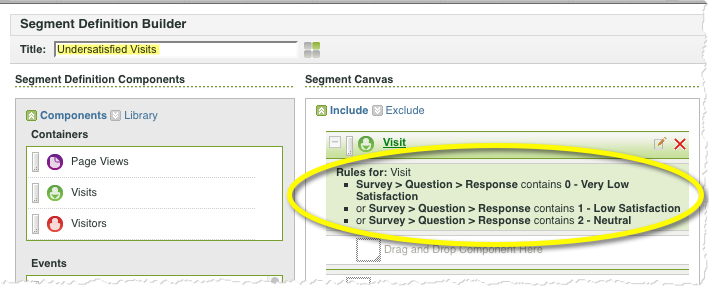
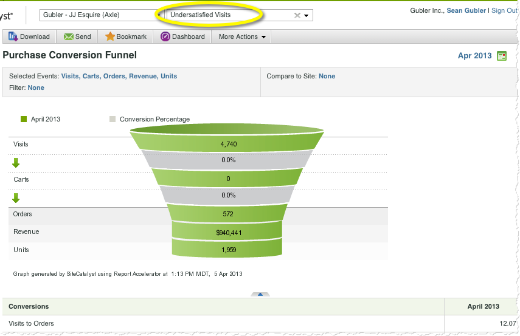

# Using the Integration{#using-the-integration}

Após a conclusão da implantação, você pode começar a usar os recursos adicionais que esta integração fornece.

>[!NOTE]
>
>Pode levar 24a 48 horas para começar a ver os dados da resposta Qualtrics nos relatórios do Adobe Analytics.

A seguir estão as ações a seguir para obter o valor dessa integração no Adobe Analytics.

1. Create a Segment using survey response data (see [Create a segment](http://microsite.omniture.com/t2/help/en_US/sc/user/index.html?f=t_segment.html)).
1. Aplique o segmento aos principais relatórios.

## Exemplo {#section-07051d0d60a44408a4e108034586c42f}

o seguinte mostra como um analista pode definir um segmento do Adobe Analytics usando dados de resposta da pesquisa. Esse caso supõe uma pergunta de pesquisa como "Qual foi a satisfação com sua visita hoje?" Usando essa pergunta, podemos criar um segmento para identificar os visitantes "Resatisfeito". Esse segmento pode ser usado para detalhar quaisquer relatórios do Adobe Analytics, como o Funil de conversão de compra, como mostrado abaixo.

 

