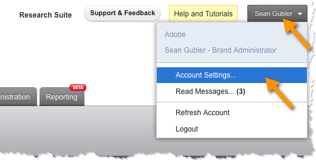

# Generating your Qualtrics Adobe Analytics Token{#generating-your-qualtrics-adobe-analytics-token}

É necessário um token para concluir o assistente de integração. Para encontrar essa ID, preencha o seguinte.

1. Faça logon no Qualtrics Research Suite.
1. Click **[!UICONTROL Account Settings]** on your user menu.

   

1. Click **[!UICONTROL Qualtrics IDs]**.

   

1. Click **[!UICONTROL Generate Token]** within the **[!UICONTROL Adobe SiteCatalyst]** section and save the token.

   

   >[!NOTE]
   >
   >Caso não veja a opção de gerar um token do Adobe Analytics, entre em contato com o administrador da sua conta Qualtrics para ativar as permissões apropriadas para a sua conta.

