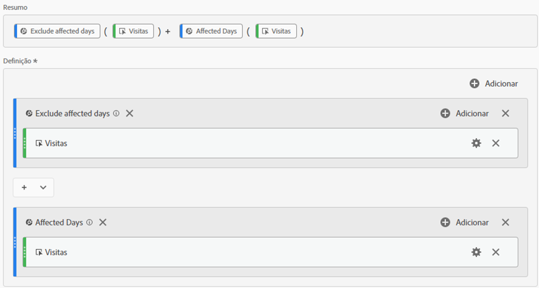
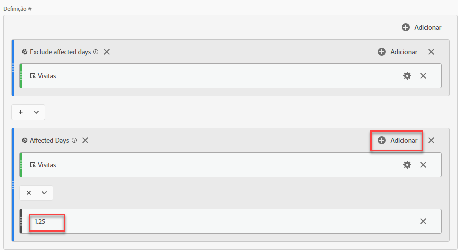
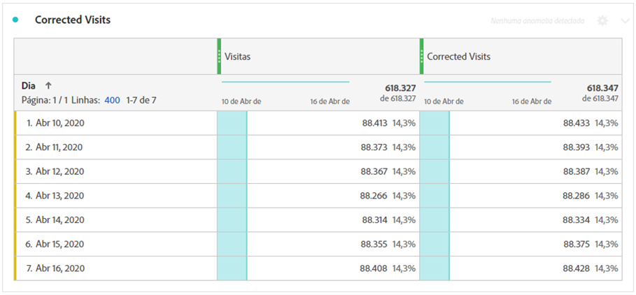
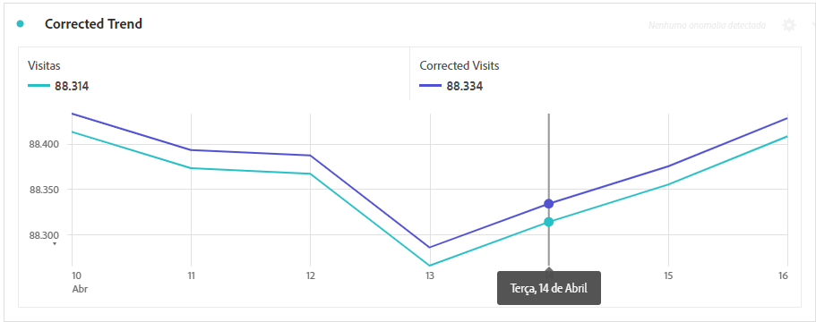

# Derivar dados afetados pelos eventos

Se você tiver dados [afetado por um evento](overview.md), você pode usar as métricas calculadas para derivar valores estimados para a duração do evento. Por exemplo, se você tiver um evento que causou uma queda de 25% nos dados, poderá usá-lo como multiplicador em uma métrica calculada.

Essas etapas funcionam melhor quando você entende o impacto de um evento, tanto da perspectiva de segmentação quanto da perspectiva de comparação de datas. Siga o exemplo [Comparar datas afetadas por um evento a intervalos anteriores](compare-dates.md) e [Excluir datas específicas na análise](segments.md) antes de seguir esta página.

>[!NOTE]
>
>Esta abordagem é uma estimativa baseada num conjunto específico de entradas e intervalos de datas. Não será uma solução abrangente para todos os casos de uso ou fatias de dados. Além disso, essa abordagem exige que o intervalo de datas afetado tenha pelo menos uma ocorrência para calcular.

Para criar uma métrica calculada estimada para o período afetado:

1. Crie dois segmentos para &quot;Dias afetados&quot; e &quot;Excluir dias afetados&quot;, conforme descrito em [Excluir datas específicas na análise](segments.md).
2. Navegue até **[!UICONTROL Componentes]** > **[!UICONTROL Métricas calculadas]**.
3. Clique em **[!UICONTROL Adicionar]**.
4. Arraste ambos os segmentos acima para a tela de definição. Altere o operador entre elas para uma `+` para os resumir.
5. Adicione a métrica desejada dentro de ambos os segmentos. Por exemplo, você pode usar a métrica &quot;Visitas&quot;.

   

6. Clique em **[!UICONTROL Adicionar]** no canto superior direito do contêiner &quot;Dias afetados&quot;, clique em **[!UICONTROL Número estático]**. Defina o número estático como a porcentagem que você deseja compensar seus dados, conforme descrito em [Comparar datas afetadas por um evento a intervalos anteriores](compare-dates.md). Neste exemplo, o deslocamento é de 25%, ou 1,25.

   

7. Aplicar a métrica &quot;corrigida&quot; lado a lado em uma tabela de forma livre com tendência. Todos os dias fora do evento refletem sua contagem de métrica normal, enquanto todos os dias afetados usam o deslocamento do multiplicador.

   

8. Visualize os dados em uma visualização de linha para ver o efeito da métrica corrigida.

   
