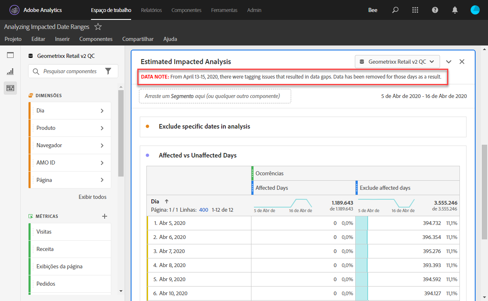
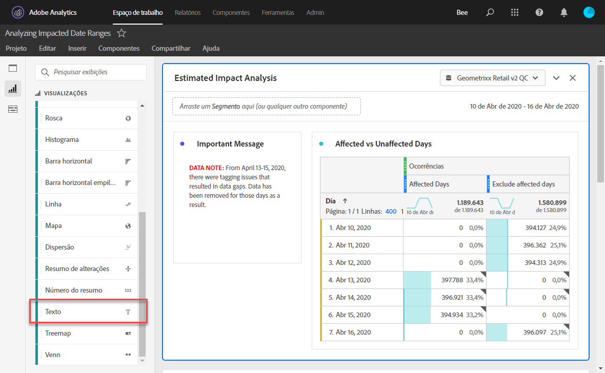
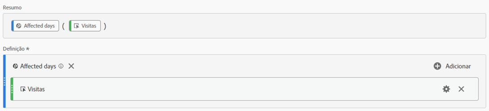
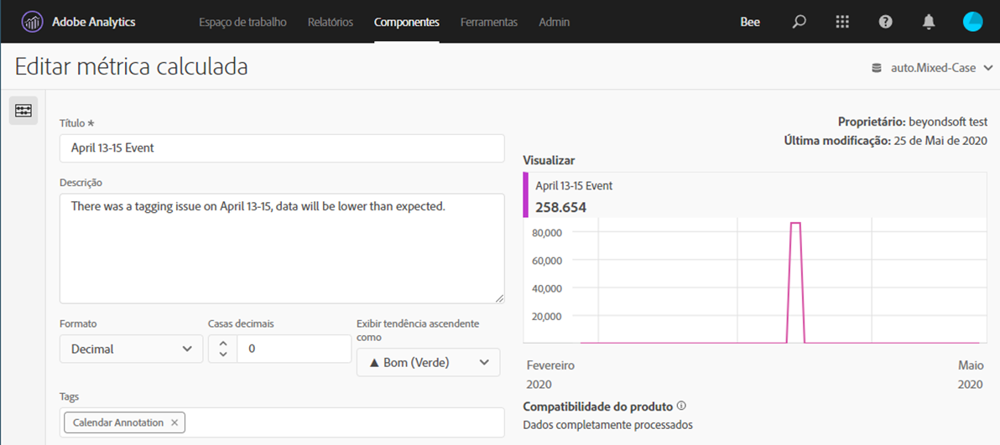
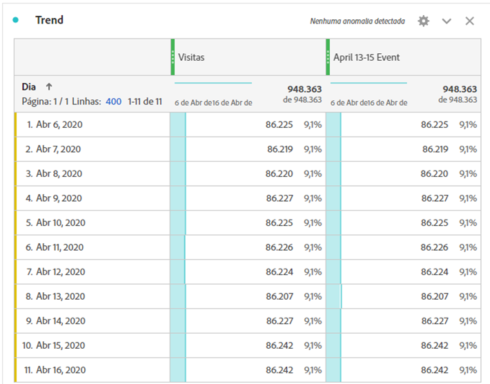
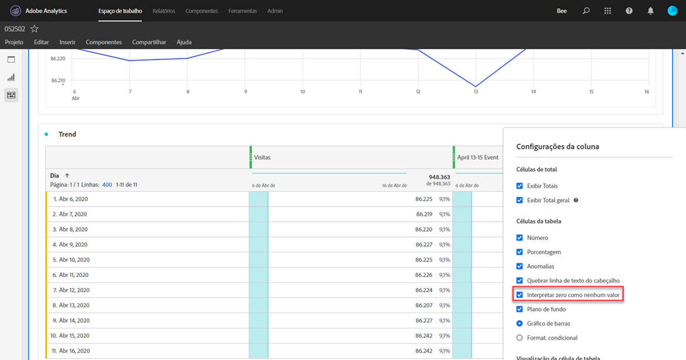
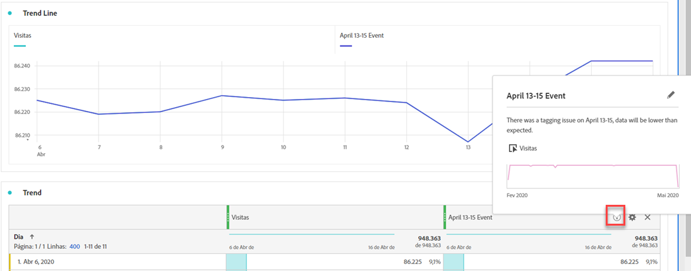
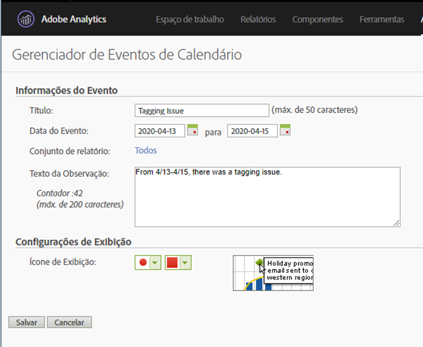

# Comunicar o impacto do evento aos usuários

Se você tiver dados [afetados por um evento](overview.md), é importante comunicar esse evento aos usuários em sua organização.

* Desenvolver um aviso de isenção de responsabilidade comum que pode ser usado nas comunicações para fins de consistência
* Fornecer comunicação contínua aos usuários do Analytics e principais partes interessadas durante e após o evento
* Coloque um lembrete de calendário para etapas subsequentes, como o mês ou ano seguinte. Essa comunicação no futuro ajuda a lembrar os usuários que visualizam relatórios do impacto em relatórios mensais ou anuais.

No Adobe Analytics, as seções a seguir mostram maneiras diferentes de se comunicar com os usuários em sua organização. Você também pode usar outros métodos fora do Adobe Analytics, como email, para se comunicar com usuários.

## Comunicar-se por meio de descrições de painel ou visualização

Se você tiver um projeto do Workspace compartilhado entre usuários em sua organização, é possível comunicar o impacto de um evento por meio de descrições de painel ou visualização. Clique com o botão direito do mouse em um painel ou cabeçalho de visualização e selecione **[!UICONTROL Editar descrição]**.

## Comunicar-se através de visualizações de texto

Também é possível comunicar o impacto de um evento por meio de visualizações de texto dedicadas. Consulte [Visualizações de texto](/help/analyze/analysis-workspace/visualizations/text.md) no guia do usuário Analisar.

## Adicionar eventos de calendário personalizados a tendências no Workspace

Para qualquer visualização com tendência no Workspace, é possível adicionar uma série que represente o intervalo de datas afetado.

1. Crie uma métrica calculada com o segmento &quot;Dias afetados&quot; seguindo [Excluir datas específicas na análise](segments.md).
1. Adicione a métrica desejada à tela de métricas calculadas.

   

1. Adicione um título e uma descrição informando os usuários sobre o impacto. Você também pode marcar essa métrica como uma anotação do calendário, se desejar.

   

1. Em uma tabela de forma livre, adicione a dimensão &quot;Dia&quot;. Adicione &quot;Visitas&quot; e a métrica calculada como colunas lado a lado.

   

1. Clique no ícone de engrenagem das configurações de coluna para sua métrica calculada e ative **[!UICONTROL Interpretar zero como nenhum valor]**.

   

1. Adicionar uma visualização de Linha . Os dias afetados são representados com uma cor diferente. Os usuários também podem clicar no ícone &quot;Informações&quot; na métrica calculada para obter mais informações.

   

## Usar um evento de calendário no Reports &amp; Analytics

Se você usar o Reports &amp; Analytics, poderá usar um [evento de calendário](/help/components/t-calendar-event.md) para realçar os dias afetados em qualquer relatório de tendências. Esse método não se aplica ao Analysis Workspace.

1. Navegue até **[!UICONTROL Componentes]** > **[!UICONTROL Todos os componentes]** > **[!UICONTROL Eventos de calendário]**.
2. Insira o título desejado, o intervalo de datas e o texto da nota.
3. Clique em **[!UICONTROL Salvar]**.

