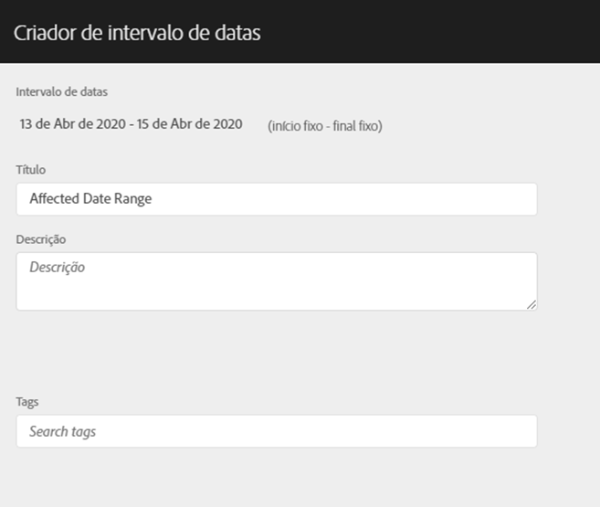
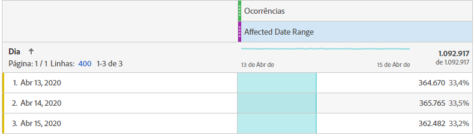
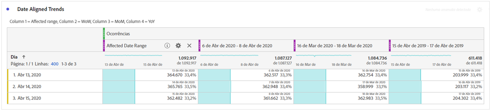
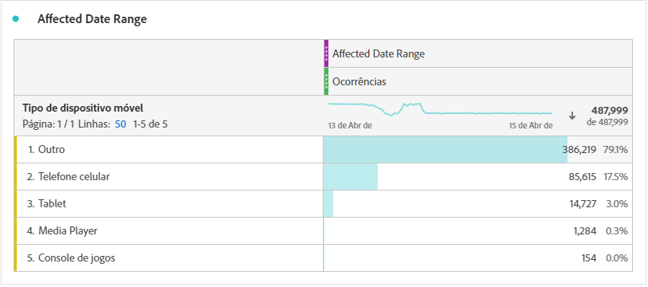
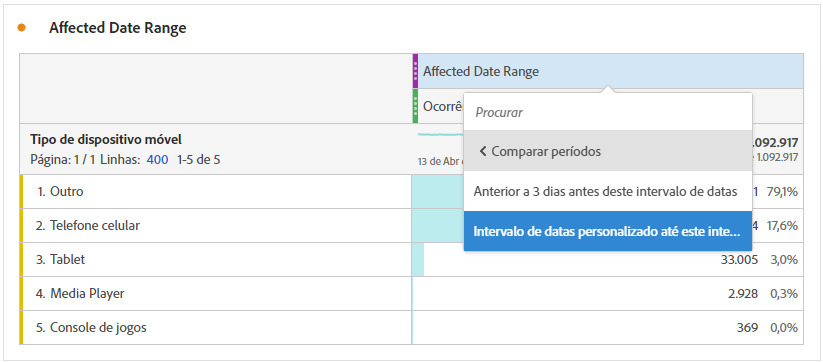
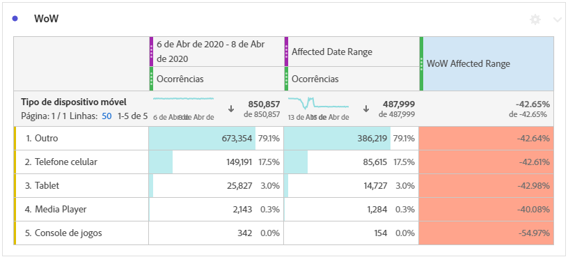
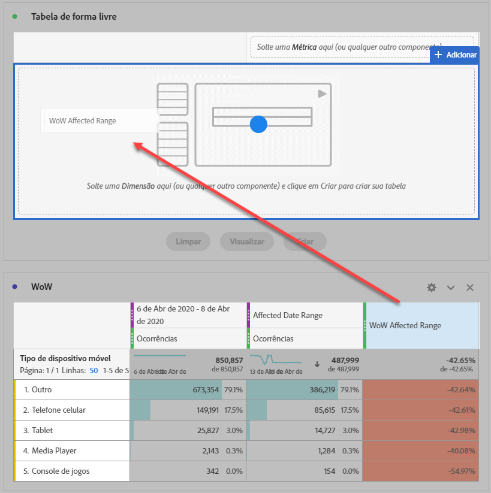
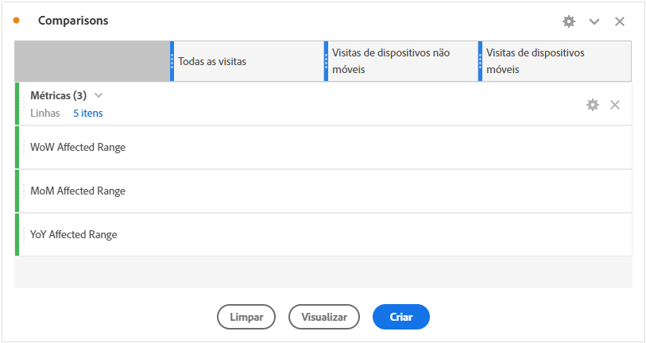
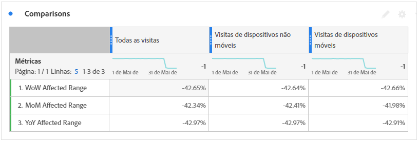

# Comparar datas afetadas por um evento a intervalos anteriores

Se você tiver dados [afetado por um evento](overview.md), você pode observar as tendências históricas para medir seu impacto. Essa comparação é importante para entender o quanto um evento afeta seus dados, para que você possa decidir se exclui-los, adicionar uma observação aos relatórios ou ignorá-los.

## Criar um intervalo de datas que inclua o evento

Crie um intervalo de datas que inclua o evento para começar a explorar o impacto desse evento.

1. Navegue até **[!UICONTROL Componentes]** > **[!UICONTROL Intervalos de datas]**.
2. Clique em **[!UICONTROL Adicionar]**.
3. Selecione o intervalo de datas em que o evento ocorreu. Clique em **[!UICONTROL Salvar]**.

   

## Exibir datas de evento e intervalos anteriores semelhantes lado a lado

É possível comparar qualquer métrica entre o intervalo de datas do evento e os intervalos de datas anteriores semelhantes usando uma visualização de tabela de forma livre.

1. Abra um projeto do Workspace e adicione a dimensão &quot;Dia&quot; à tabela de forma livre. Aplique o intervalo de datas criado recentemente e empilhado em uma métrica, como &quot;Ocorrências&quot;.

   

2. Clique com o botão direito do mouse no intervalo de datas e clique em **[!UICONTROL Adicionar coluna de período]** > **[!UICONTROL Intervalo de datas personalizado para esse intervalo de datas]**.
   * Para uma comparação entre semanas, selecione o intervalo do evento menos 7 dias. Verifique se os dias da semana entre o evento e esse intervalo de datas estão alinhados.
   * Para uma comparação mês a mês, selecione o intervalo do evento no mês passado. Você também pode selecionar o intervalo do evento menos 28 dias se desejar alinhar os dias da semana.
   * Para uma comparação ano a ano, selecione o intervalo do evento no ano passado.
3. Ao selecionar o intervalo de datas desejado, eles são adicionados à tabela de forma livre. Você pode clicar com o botão direito do mouse e adicionar quantos intervalos de datas desejar comparar.

   

## Calcular diferenças percentuais entre o evento e intervalos anteriores semelhantes

Compare itens de dimensão entre o intervalo de datas de um evento e intervalos de datas anteriores semelhantes usando uma visualização de tabela de forma livre. Essas etapas ilustram um exemplo de semana a semana que você pode seguir.

1. Abra um projeto do Workspace e adicione um **dimensão sem hora** à tabela de forma livre. Por exemplo, você pode usar a dimensão &quot;Tipo de dispositivo móvel&quot;. Aplique o intervalo de datas criado recentemente e empilhado em uma métrica, como &quot;Ocorrências&quot;:

   

2. Clique com o botão direito do mouse no intervalo de datas e clique em **[!UICONTROL Comparar períodos]** > **[!UICONTROL Intervalo de datas personalizado para esse intervalo de datas]**. Selecione o intervalo do evento menos 7 dias. Verifique se os dias da semana entre o evento e esse intervalo de datas estão alinhados.

   

3. Renomeie a métrica &quot;Alteração percentual&quot; resultante para algo mais específico, como &quot;Intervalo afetado por WoW&quot;. Clique no ícone de informações e, em seguida, clique no lápis de edição para editar o nome da métrica.

   

4. Repita as etapas 3 e 4 para comparações mês a mês e ano a ano. Essa ação pode ser executada na mesma tabela ou em tabelas separadas.

## Analisar intervalos de datas de comparação lado a lado como linhas

Se você quiser analisar mais detalhadamente as alterações de porcentagem acima, poderá convertê-las em linhas.

1. Adicione uma visualização de tabela de forma livre e ative o construtor de tabela. Essa ação permite colocar as métricas de alteração de porcentagem na ordem desejada.
2. Em espera `Ctrl` (Windows) ou `Cmd` (Mac) e arraste as métricas de alteração de 3% para as linhas da tabela, uma de cada vez.

   

3. Adicione o segmento &quot;Todas as visitas&quot; à coluna da tabela e a qualquer outro segmento desejado.

   

4. Clique em **[!UICONTROL Criar]**. Na tabela resultante, é possível visualizar os intervalos afetados em relação à semana, mês e ano anteriores em qualquer segmento desejado.

   
