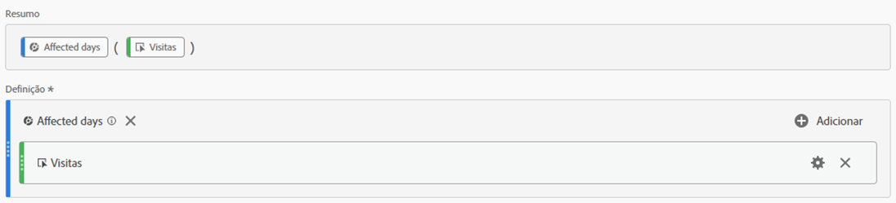
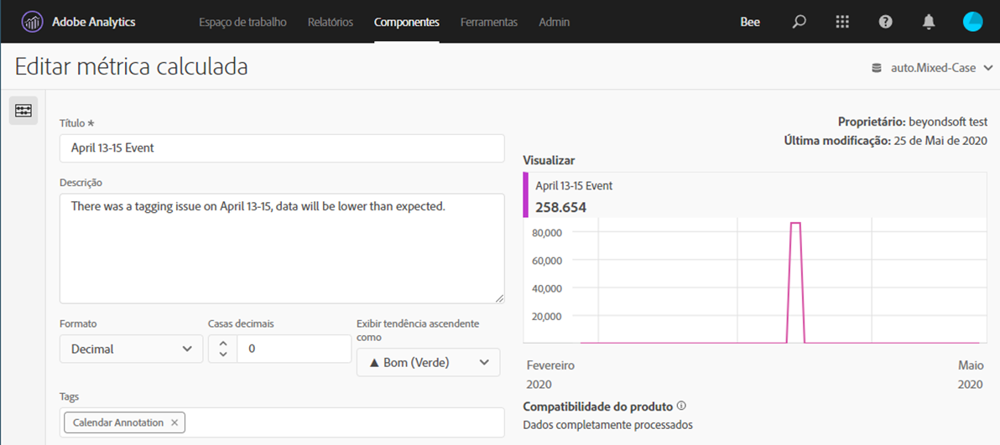
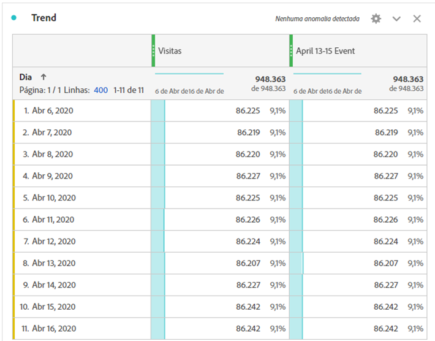
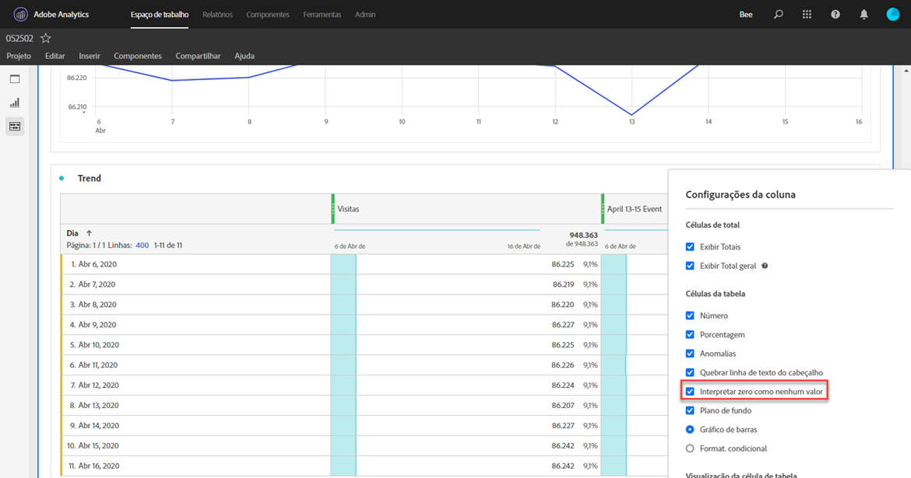
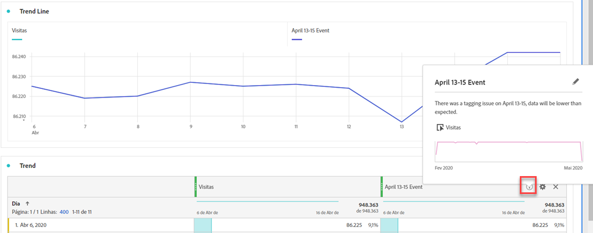

# Comunicar impacto aos usuários

Se você tiver dados [afetados por um evento](../event-impacted.md), é importante comunicar esse evento aos usuários em sua organização.

* Desenvolver um aviso comum que você pode usar nas comunicações para fins de consistência
* Fornecer comunicação contínua aos usuários do Analytics e às principais partes interessadas durante e após o evento
* Coloque um lembrete de calendário para marcos subsequentes, como o mês ou ano seguinte. Esta comunicação no futuro ajuda a lembrar os usuários que visualizam relatórios do impacto nos relatórios mês por mês ou ano por ano.

No Adobe Analytics, as seções a seguir mostram maneiras diferentes de se comunicar com os usuários em sua organização. Você também pode usar outros métodos fora do Adobe Analytics, como email, para se comunicar com os usuários.

## Comunicar-se por meio de descrições de painel ou visualização

Se você tiver um projeto da Workspace compartilhado entre usuários em sua organização, poderá comunicar o impacto de um evento por meio de descrições de painel ou visualização. Clique com o botão direito do mouse em um painel ou cabeçalho de visualização e selecione **[!UICONTROL Edit description]**.

## Comunicar-se através de visualizações de texto

Também é possível comunicar o impacto de um evento por meio de visualizações de texto dedicadas. See [Text visualizations](/help/analyze/analysis-workspace/visualizations/text.md) in the Analyze user guide.

## Adicionar eventos de calendário personalizados a tendências no Workspace

Para qualquer visualização de tendências no Workspace, é possível adicionar uma série que representa o intervalo de datas afetado.

1. Crie uma métrica calculada com o segmento &quot;Dias afetados&quot; seguindo [Excluir datas específicas na análise](/help/components/c-segmentation/use-cases/exclude-date-range.md).
1. Adicione a métrica desejada à tela da métrica calculada.

   

1. Adicione um título e uma descrição informando os usuários sobre o impacto. Você também pode marcar essa métrica como uma anotação de calendário, se desejar.

   

1. Em uma tabela de forma livre, adicione a dimensão &#39;Dia&#39;. Adicione &quot;Visitas&quot; e sua métrica calculada como colunas lado a lado.

   

1. Clique no ícone de engrenagem de configurações de coluna para sua métrica calculada e ative **[!UICONTROL Interpret zero as no value]**.

   

1. Adicionar uma visualização de Linha. Os dias afetados são representados com uma cor diferente. Os usuários também podem clicar no ícone &quot;Informações&quot; na métrica calculada para obter mais informações.

   

## Usar um evento de calendário no Relatórios e análises

Se você usar o Relatórios e análises, poderá usar um evento [de](/help/components/t-calendar-event.md) calendário para realçar os dias afetados em qualquer relatório de tendências. Este método não se aplica à área de trabalho de Análise.

1. Navegue até **[!UICONTROL Components]** > **[!UICONTROL Calendar events]**.
2. Insira o título desejado, o intervalo de datas e o texto da nota.
3. Clique em **[!UICONTROL Save]**.

