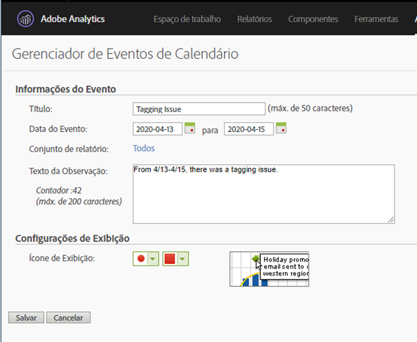

# Comunicar impacto aos usuários

Se você tiver dados [afetados por um evento](../event-impacted.md), é importante comunicar esse evento aos usuários em sua organização. As seções a seguir mostram maneiras diferentes de se comunicar com os usuários em sua organização.

## Comunicar-se por meio de descrições de painel ou visualização

Se você tiver um projeto da Workspace compartilhado entre usuários em sua organização, poderá comunicar o impacto de um evento por meio de descrições de painel ou visualização. Clique com o botão direito do mouse em um painel ou cabeçalho de visualização e selecione **[!UICONTROL Edit description]**.

## Comunicar-se através de visualizações de texto

Também é possível comunicar o impacto de um evento por meio de visualizações de texto dedicadas. See [Text visualizations](/help/analyze/analysis-workspace/visualizations/text.md) in the Analyze user guide.

## Usar um evento de calendário no Relatórios e análises

Se você usar o Relatórios e análises, poderá usar um evento [de](/help/components/t-calendar-event.md) calendário para realçar os dias afetados em qualquer relatório de tendências. Este método não se aplica à área de trabalho de Análise.

1. Navegue até **[!UICONTROL Components]** > **[!UICONTROL Calendar events]**.
2. Insira o título desejado, o intervalo de datas e o texto da nota.
3. Clique em **[!UICONTROL Save]**.

