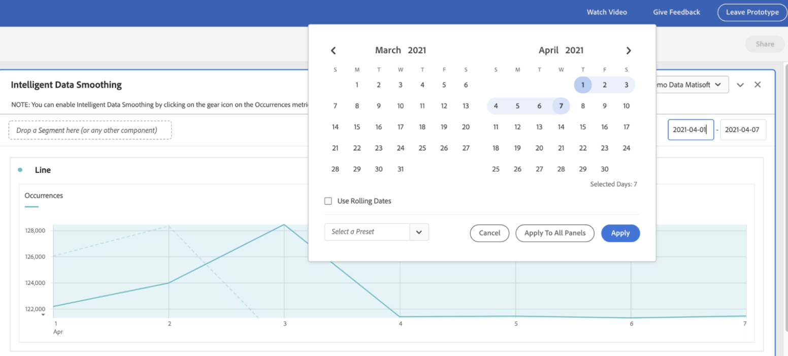

# Suavização inteligente de dados

Em raras ocasiões, alguns fatores podem afetar a qualidade dos dados. O tráfego de bot, as alterações de implementação ou as interrupções de serviço podem afetar a integridade dos dados coletados. Elas também complicam a análise de como o evento pode ter afetado a integridade dos dados.

A Suavização Inteligente de Dados é um protótipo no [Analytics Labs](/help/analyze/labs.md) que pode ajudar a concluir esta exibição, analisando tendências históricas para prever o valor de qualquer métrica no período afetado. O protótipo aplica algoritmos avançados de aprendizado de máquina para plotar os valores esperados para métricas durante o período em análise.

## Executar Suavização Inteligente de Dados

1. Navegue até o Adobe Analytics Labs:
   
1. Inicie o protótipo Suavização inteligente de dados.
   
1. Adicione a métrica que deve ser analisada à tabela de Forma livre. O protótipo funciona apenas com uma granularidade diária, portanto, verifique se a dimensão na tabela é Dia.
   
1. Escolha um intervalo de datas mais amplo que a janela do evento, mas verifique se ele inclui o evento.
   
1. Clique no ícone de engrenagem da métrica na tabela de Forma livre.
   
1. Em [!UICONTROL Configurações de Dados], selecione a opção [!UICONTROL Suavização de dados].
   
1. Selecione a data/intervalo de datas correspondente ao evento e clique em [!UICONTROL Aplicar].
Verifique se o intervalo de dados da Suavização de dados é um subconjunto do intervalo de datas selecionado para o painel. A métrica na tabela e no gráfico é substituída pelos valores previstos.
   
