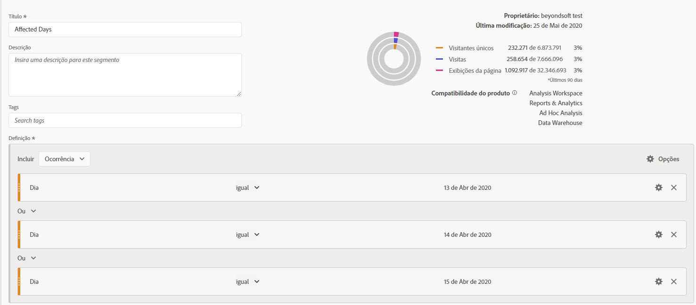
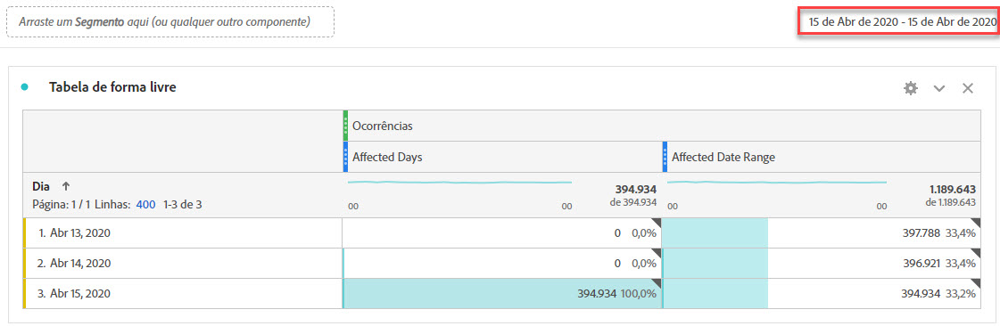
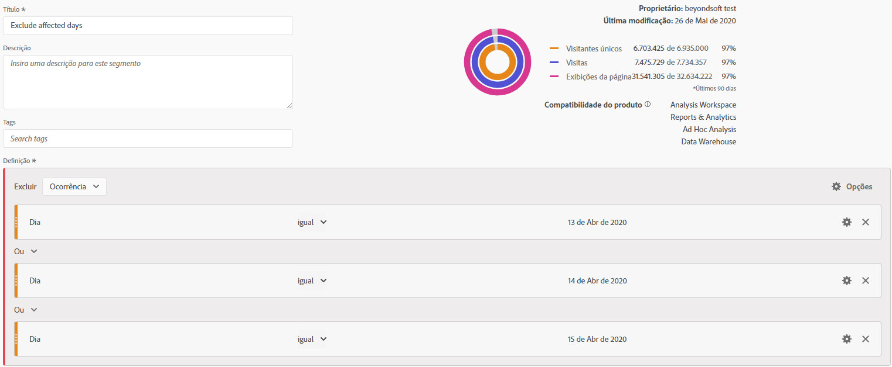
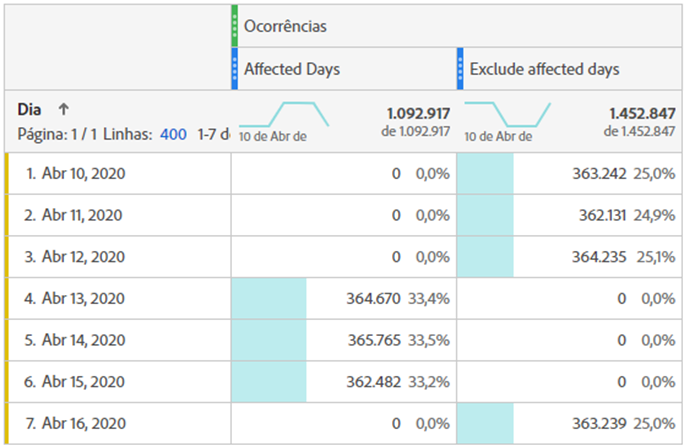
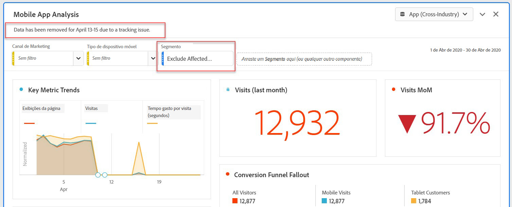
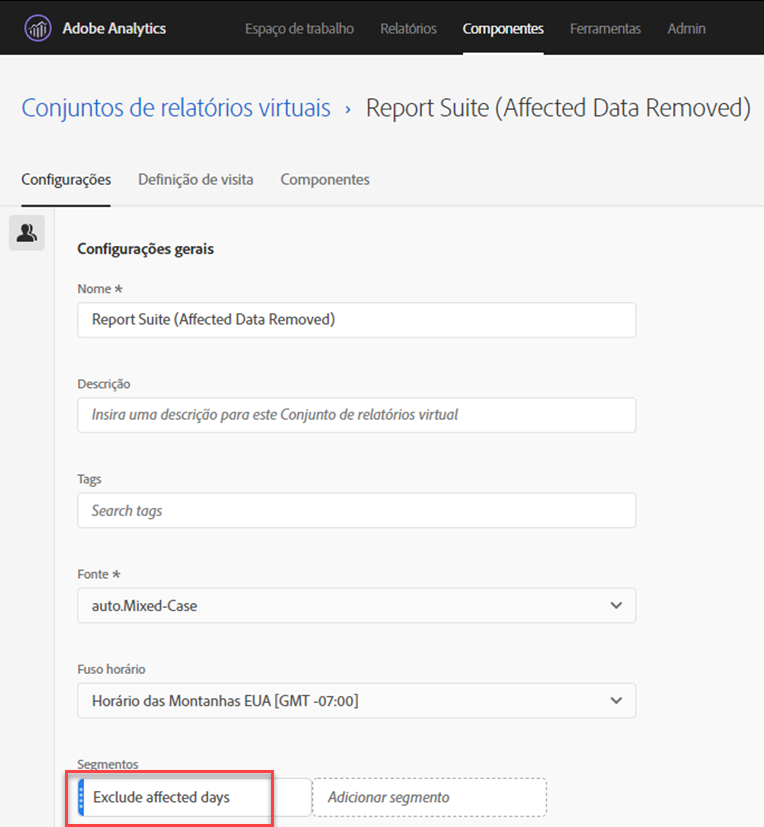

# Excluir datas específicas na análise

Se você tiver dados [afetado por um evento](overview.md), você pode usar um segmento para excluir qualquer intervalo de datas que não queira incluir nos relatórios. A segmentação de datas afetadas pelo evento pode ajudar a impedir que sua organização tome decisões em dados parciais.

## Isole os dias afetados

Crie um segmento que isole o dia ou o intervalo de datas afetado. Esse segmento é útil se você quiser se concentrar apenas nos dias problemáticos para ver mais informações sobre o impacto.

1. Abra o construtor de segmentos acessando **[!UICONTROL Componentes]** > **[!UICONTROL Segmentos]**, depois clique em **[!UICONTROL Adicionar]**.
2. Arraste a dimensão &quot;Dia&quot; para a tela de definição e defina-a como o dia que deseja isolar.
3. Repita a etapa acima para cada dia que desejar isolar no relatório.

>[!TIP]
>
>Para alterar a instrução OR para uma instrução AND, clique na seta para baixo ao lado de OR e selecione AND.

O Adobe recomenda usar os componentes de dimensão laranja, e não os componentes de intervalo de datas violeta. Se você usar componentes de intervalo de datas violeta, eles substituirão o intervalo de calendário do projeto:

## Excluir dias afetados

Crie um segmento que exclua o dia ou o intervalo de datas afetado. Esse segmento é útil se você quiser excluir os dias que tiveram problemas para minimizar o impacto no relatório geral.

1. Abra o construtor de segmentos acessando **[!UICONTROL Componentes]** > **[!UICONTROL Segmentos]**, depois clique em **[!UICONTROL Adicionar]**.
2. Na parte superior direita da tela de definição do segmento, clique em **[!UICONTROL Opções]** > **[!UICONTROL Excluir]**.
3. Arraste a dimensão &quot;Dia&quot; para a tela de definição e defina-a como o dia que deseja remover.
4. Repita a etapa acima para todos os dias que você deseja remover no relatório.

## Usar esses segmentos em relatórios

Após criar o segmento excluído, é possível usá-lo exatamente como usaria outros segmentos.

### Comparar segmentos em um relatório de tendências

É possível aplicar o segmento &quot;Dias afetados&quot; e &quot;Excluir dias afetados&quot; em um relatório para compará-los lado a lado. Arraste ambos os segmentos acima ou abaixo de uma métrica para compará-los:

Se não quiser mostrar zeros na tabela ou nas visualizações (causando declínios), ative **[!UICONTROL Interpretar zero como valor inexistente]** em configurações de coluna.

Se não quiser mostrar zeros na tabela ou nas visualizações (causando declínios), ative **[!UICONTROL Interpretar zero como valor inexistente]** em configurações de coluna.

### Aplicar o segmento de exclusão a um projeto

Você pode aplicar o segmento &quot;Excluir dias afetados&quot; a um projeto do Workspace. Arraste o segmento excluído até a seção da tela do Workspace rotulada *Solte um segmento aqui*.

>[!TIP]
>
>Inclua uma observação sobre os dados excluídos na descrição do painel para ajudar aqueles que visualizam o relatório. Clique com o botão direito do mouse no título de um painel e depois clique em **[!UICONTROL Editar descrição]**.

### Usar o segmento excluído em um conjunto de relatórios virtual

Você pode usar o segmento em uma [Conjunto de relatórios virtual](/help/components/vrs/vrs-about.md) para excluir os dados de maneira mais conveniente. Essa opção é ideal, pois não é necessário lembrar de aplicar o segmento para cada relatório que inclui o intervalo de datas afetado. Se você já usa conjuntos de relatórios virtuais como a fonte de dados principal, é possível adicionar o segmento a um VRS existente.

1. Navegar para **[!UICONTROL Componentes]** > **[!UICONTROL Conjuntos de relatórios virtuais]**.
2. Clique em **[!UICONTROL Adicionar]**.
3. Insira o nome e a descrição desejados para o conjunto de relatórios virtual.
4. Arraste o segmento excluído para a área rotulada **[!UICONTROL Adicionar segmento]**.
5. Clique em **[!UICONTROL Continuar]** no canto superior direito, em seguida, clique em **[!UICONTROL Salvar]**.

