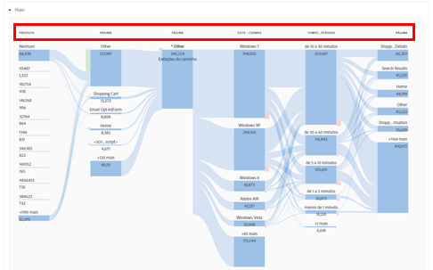

# Relatórios de comportamento

Os relatórios de comportamento mostram informações sobre como os usuários interagem com seu site.

Esta página considera que o usuário tem um conhecimento básico sobre como usar a Analysis Workspace. See [Create a basic report in Analysis Workspace for Google Analytics users](create-report.md) if you are not yet familiar with the tool in Adobe Analytics.

## Fluxo de comportamento

O relatório de fluxo de comportamento pode ser recriado usando a visualização de Fluxo.

1. Clique no ícone de visualizações à esquerda e arraste uma visualização de Fluxo até a área de trabalho acima da tabela de forma livre
2. Locate the **Page** dimension, then click the Arrow icon to reveal page values. Os valores de dimensão são coloridos amarelos.
3. Localize o valor da página desejada para começar e arraste-o para o espaço denominado &quot;Dimensão ou item&quot; no centro
4. Este relatório de fluxo é interativo. Clique em qualquer um dos valores para expandir os fluxos para páginas subsequentes ou anteriores. Use o menu de clique com o botão direito para expandir ou recolher colunas. Diferentes dimensões também podem ser usadas no mesmo relatório de fluxo.

## Conteúdo do site - Todas as páginas

O relatório de páginas mostra o desempenho de páginas individuais no site.

1. In the Components menu, locate the **Pages** dimension and drag it onto the large freeform table area labeled &#39;Drop a Dimension here&#39;.
2. Drag the desired metrics onto the workspace alongside the automatically created **Occurrences** metric. See the [Metric translation guide](common-metrics.md) for details on how to obtain each respective metric.

Como alternativa, a Adobe fornece várias áreas de trabalho pré-criadas chamadas modelos. O modelo de Consumo de conteúdo (Web) fornece valor semelhante ao relatório de todas as páginas.

1. Click *[!UICONTROL Project] &gt; [!UICONTROL New]*, which opens a modal window with project options.
2. Clique no modelo de Consumo de conteúdo (Web) e clique em Criar.

## Conteúdo do site - Detalhamento do conteúdo

O relatório de detalhamento de conteúdo permite analisar o tráfego da página por estrutura de URL. A implementação adicional é necessária para uso na Analysis Workspace. A Adobe recomenda trabalhar com um consultor de implementação para garantir que esses dados sejam coletados com precisão.

## Conteúdo do site - Páginas de aterrissagem

O relatório de páginas iniciais mostra as principais páginas de aterrissagem do site. Landing pages are available in Analysis Workspace as the **Entry Page** dimension.

1. In the Components menu, locate the **Entry Page** dimension and drag it onto the large freeform table area labeled &#39;Drop a Dimension here&#39;.
2. Drag the desired metrics onto the workspace alongside the automatically created **Occurrences** metric. See the [Metric translation guide](common-metrics.md) for details on how to obtain each respective metric.

Adobe recommends using the **Visits** metric for this dimension.

## Conteúdo do site - Páginas de saída

O relatório de páginas de saída mostra as páginas principais que se tornaram a última página da visita de um indivíduo. Ele está disponível na Analysis Workspace com o mesmo nome.

1. In the Components menu, locate the **Exit Page** dimension and drag it onto the large freeform table area labeled &#39;Drop a Dimension here&#39;.
2. Drag the desired metrics onto the workspace alongside the automatically created **Occurrences** metric. See the [Metric translation guide](common-metrics.md) for details on how to obtain each respective metric.

Adobe recommends using the **Visits** metric for this dimension.

## Relatórios de velocidade do site

Os relatórios de velocidade do site mostram a velocidade com que as páginas são carregadas, revelando oportunidades para aumentar o tempo de carregamento de sua página.

Esse recurso requer implementação adicional em ambas as plataformas; A Adobe recomenda trabalhar com um consultor de implementação para garantir que esses dados estejam configurados corretamente para a Analysis Workspace. The [Performance Timing plugin](../../../implement/js-implementation/plugins/performancetiming.md) is typically assigned to an eVar to obtain performance data in Adobe Analytics.

## Relatórios de pesquisa do site

Os relatórios de pesquisa do site fornecem informações sobre como os visitantes usam os recursos de pesquisa internos do site.

Esse recurso requer implementação adicional em ambas as plataformas; A Adobe recomenda trabalhar com um consultor de implementação para garantir que esses dados estejam configurados corretamente para a Analysis Workspace. Normalmente, um termo de pesquisa interna é retirado de um parâmetro da string de consulta e colocado em uma evar para relatório.

## Relatórios de eventos

Os eventos têm algumas diferenças estruturais importantes entre o Google e o Adobe Analytics. Ambas exigem alterações de implementação adicionais para funcionar adequadamente na respectiva plataforma.

* No Google Analytics, os eventos são definidos na implementação como texto. Os eventos têm categorias, ações e rótulos.
* No Adobe Analytics, os eventos são configurados primeiro no Admin Console, onde ele recebe um identificador. Esse identificador é usado no código de implementação. Por exemplo:
   1. Você pode definir event 1 no Console de administração como &quot;Registros&quot;.
   2. Na implementação, você deve incluir event 1 na variável de eventos na página de confirmação de registro. Cada vez que a página de confirmação de registro é exibida, event 1 aumenta.
   3. Na Analysis Workspace, &quot;Registros&quot; são exibidos como uma métrica para uso em qualquer relatório.

Como esse recurso requer alterações de implementação, a Adobe recomenda trabalhar com um consultor de implementação para garantir que os dados sejam corretamente configurados para a Analysis Workspace.

## Relatórios do editor

Semelhante a como o Google exige uma conexão com o Google Ad Manager, a Adobe oferece um produto dedicado para fornecer insight chamado Adobe Advertising Cloud. Se sua organização estiver interessada em usar este produto, entre em contato com o Gerente de conta de sua organização.
