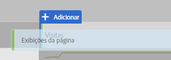

# Métricas frequentemente usadas em outras plataformas de tradução

Em outras plataformas, como o Google Analytics, muitos relatórios compartilham um número comum de métricas. Use essa página para compreender como recriar as métricas usadas em muitos relatórios.

Para adicionar várias métricas a uma tabela de forma livre de espaço de trabalho, arraste a métrica da área de componentes ao lado do cabeçalho da métrica na área de trabalho:

## Métricas de aquisição

**Os usuários** são aproximadamente iguais a **Visitantes únicos** no Workspace. See the [Unique Visitors](../../../components/c-variables/c-metrics/metrics-unique-visitors.md) metric in the Components user guide for additional details.

**Os novos usuários** podem ser obtidos pelo seguinte:

1. Drag the **Unique Visitors** metric onto the workspace.
2. Drag the **First Time Visits** segment above the Unique Visitors metric headers:

   

**As sessões** são aproximadamente iguais a **Visitas** na Analysis Workspace. See the [Visits](../../../components/c-variables/c-metrics/metrics-visit.md) metric in the Components user guide for additional details.

## Métricas de comportamento

**A Taxa** de rejeição está prontamente disponível na Analysis Workspace como uma métrica. See the [Bounce Rate](../../../components/c-variables/c-metrics/metrics-bounce-rate.md) metric in the Components user guide for additional information.

**Páginas/Sessão** é uma métrica calculada. Ele pode ser obtido pelo seguinte:

1. Se você já criou essa métrica calculada, localize-a em Métricas e arraste-a até a área de trabalho.
2. If you have not yet created this calculated metric, click the **+** icon near the metric list to open the Calculated Metric Builder.
3. Atribua um título de "Visualizações de página por visita" e uma descrição, se desejar.
4. Defina o formato como Decimal e defina o número de casas decimais como 2.
5. Drag the **Page views** metric and **Visits** metric into the definition area.
6. Arrange the definition so the formula is **Page Views divided by Visits**.

   

7. Clique em Salvar para voltar para a área de trabalho.
8. Arraste a métrica calculada recém-definida para a área de trabalho.

   Learn more about [Calculated Metrics](../../../components/c-variables/c-metrics/calculated-metric.md) in the Components user guide.

**Média Session Duration** is approximately equal to **Time Spent per Visit (seconds)**. Learn more about [Time Spent](../../../components/c-variables/c-metrics/metrics-time-spent.md) metrics in the Components user guide.

## Métricas de conversões

**Taxa de conversão de objetivo**, **Conclusões** de meta e Valor **de meta** exigem implementação adicional em ambas as plataformas. Se sua implementação já atender a dimensões de produtos e eventos de compra, considere as seguintes etapas:

1. Drag the **Orders** metric, **Revenue** metric, and **Visits** metric onto the workspace.
1. Create a calculated metric of **Orders per Visit**. Use ctrl + clique (Windows) ou cmd + clique (Mac) em ambos os cabeçalhos de métricas para destacá-los. Right-click one of the headers, select **Create Metric From Selection**, then click **Divide**. Essa nova métrica é semelhante a uma Taxa de conversão do objetivo.
1. Se as casas decimais forem necessárias, edite a métrica calculada. Clique no botão Informações no cabeçalho da métrica e, em seguida, no ícone de lápis. Adicione 1 ou 2 Casas decimais na janela Construtor de métricas calculadas e clique em Salvar.

   

Se a implementação ainda não acomodar os dados de produto ou conversão, a Adobe recomenda trabalhar com um consultor de implementação para garantir a qualidade e a integridade dos dados.
