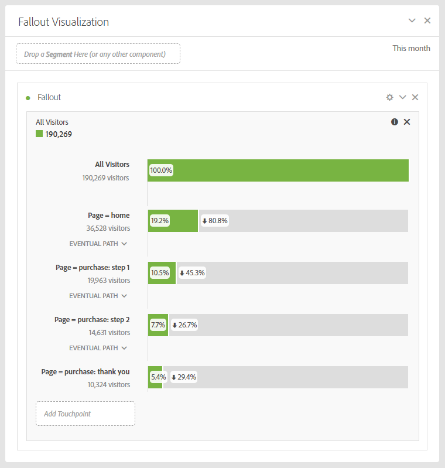

# Relatórios de conversões

Uma «conversão» é uma ação que um visitante faz no seu site que traduz diretamente para os principais indicadores de sua organização. Os relatórios de conversões mostram detalhes sobre como os visitantes estão convertendo.

Esta página considera que o usuário tem um conhecimento básico sobre como usar a Analysis Workspace. See [Create a basic report in Analysis Workspace for Google Analytics users](create-report.md) if you are not yet familiar with the tool in Adobe Analytics.

## Relatórios de metas

Os objetivos fornecem aos usuários do Google Analytics uma maneira de definir a conversão de um site. Eles são a maneira padrão de criar funis, fluxo comportamental reverso, funis de vários canais e atribuição. Os objetivos no Google Analytics não são retroativos e podem ser configurados somente na página de administração. Além disso, são baseados em apenas uma página, evento, tempo gasto ou número médio de páginas.

No Adobe Analytics, o conceito de objetivo não é obrigatório, pois as métricas podem ser aplicadas em qualquer contexto. Contanto que sua implementação acomoda os eventos que você deseja rastrear, você pode ajustar qualquer relatório de conversão e obter resultados imediatamente para dados históricos.

### Visualização de funil

O relatório de visualização de funil ajuda os analistas a se concentrar em uma série específica de etapas necessárias para converter. Por exemplo, antes de realizar uma compra, um visitante em um site de comércio eletrônico precisa acessar o carrinho de compras, a página de cobrança e a página de remessa, a página de pagamento e a página de revisão de pedido.

Na Analysis Workspace, esses dados podem ser visualizados usando a visualização de Fallout.

1. Clique no ícone de visualizações à esquerda e arraste uma visualização de Fallout até a área de trabalho acima da tabela de forma livre
2. Click the components icon on the left, then locate the **Pages** dimension.
3. Clique no ícone de seta próximo à dimensão Páginas para revelar os valores da página. Os valores de dimensão são coloridos amarelos.
4. Localize a página desejada para agir como o primeiro ponto de contato e arraste-a para o espaço denominado &quot;Adicionar ponto de contato&quot; na visualização.
5. Continue a adicionar pontos de contato desejados arrastando os valores da página para a visualização.

A visualização de Fallout não está limitada a apenas a dimensão Páginas. Qualquer dimensão, métrica ou segmento pode ser usada para adaptar seu relatório de fallout para atender às necessidades de sua organização.

## Relatórios de comércio eletrônico

Os relatórios de comércio eletrônico normalmente são usados por sites que vendem produtos ou serviços para medir pedidos e receita sobre itens comprados. Este recurso está disponível no Adobe Analytics e é conhecido como relatórios de Produtos.

Os relatórios de comércio eletrônico no Google Analytics e nos relatórios de produtos no Adobe Analytics exigem alterações de implementação personalizadas para uso. See the [Products](../../../components/c-variables/dimensionslist/reports-products.md) dimension in the Components user guide for more information.

## Relatórios de funil multicanal

Relatórios de funil de multicanal fornecem dados adicionais de canal de marketing além dos relatórios de aquisição fornecidos. Esses relatórios se concentram em como os visitantes convertem, em vez de como os visitantes chegam ao seu site.

> [!NOTE]
>
> O uso de relatórios multicanais no Adobe Analytics exige a configuração dos Canais de marketing e uma implementação personalizada para acomodar a variável products e o evento de compra. A Adobe recomenda trabalhar com um consultor de implementação se esses recursos ainda não estiverem configurados para o conjunto de relatórios.

### Multicanal - Conversões assistido

As conversões auxiliadas mostram quantas vezes cada canal é assistido com uma conversão. In Analysis Workspace, the **Order Assists** metric can be used.

1. In the Components menu, locate the **Marketing Channel** dimension and drag it onto the large freeform table area labeled &#39;Drop a Dimension here&#39;.
2. Drag the **Order Assists** metric on top of the automatically created **Occurrences** metric header to replace it. Métricas adicionais podem ser arrastadas para a área de trabalho, se desejado.

### Multi-Canal - Caminhos de conversão principais

O relatório de caminhos de conversão principais mostra os principais caminhos de canal que um usuário segue antes da conversão. A Analysis Workspace usa um relatório de fluxo para visualizar os caminhos de conversão principais.

1. Clique no ícone Painéis à esquerda e arraste um painel de Atribuição acima da tabela de forma livre.
2. Click the Components icon on the left, locate the **Marketing Channel** dimension, and drag it to the box labeled &#39;Add Dimension&#39;.
3. Localize o evento de conversão desejado em Métricas (por exemplo, Pedidos) e arraste-o para a caixa denominada &quot;Adicionar métrica&quot;. Observe que as métricas calculadas não são compatíveis com o painel Atribuição.
4. Clique em Construir.
5. No relatório resultante, localize a visualização «Fluxo de canal». Esse fluxo mostra os caminhos principais que um visitante tocou antes de uma compra.

Essa visualização de fluxo é interativa. Clique em cada canal para expandir o fluxo em qualquer direção.

### Multicanal - Tempo limite

O relatório de tempo limite mostra o tempo em dias necessários para a conversão de um visitante em seu site. In Analysis Workspace, this data is available using the **Days Before First Purchase** dimension. Ela só está disponível no contexto de um evento de compra implementado corretamente.

1. In the Components menu, locate the **Days Before First Purchase** dimension and drag it onto the large freeform table area labeled &#39;Drop a Dimension here&#39;.
2. Drag the desired metrics onto the workspace alongside the automatically created **Occurrences** metric. See the [Metric translation guide](common-metrics.md) for details on how to obtain each respective metric.

Adobe recommends using the **Orders**, **Units**, or **Revenue** metrics with this dimension.

For other types of conversions, including custom events, the **Time Prior to Event** dimension is available. Isso mostra o tempo, em minutos, necessário para um visitante acionar o evento na visita.

1. In the Components menu, locate the **Time Prior to Event** dimension and drag it onto the large freeform table area labeled &#39;Drop a Dimension here&#39;.
2. Drag the desired metrics onto the workspace alongside the automatically created **Occurrences** metric. See the [Metric translation guide](common-metrics.md) for details on how to obtain each respective metric.

A Adobe recomenda usar essa dimensão junto com eventos personalizados ou eventos de compra.

### Multi-Canal - Extensão do Caminho

O relatório de extensão do caminho mostra o número de canais abordados antes de um evento de conversão. Na Analysis Workspace, o painel Atribuição contém esses dados em uma das visualizações.

1. Clique no ícone Painéis à esquerda e arraste um painel de Atribuição acima da tabela de forma livre
2. Click the Components icon on the left, locate the **Marketing Channel** dimension, and drag it to the box labeled &#39;Add Dimension&#39;.
3. Localize o evento de conversão desejado em Métricas (por exemplo, Pedidos) e arraste-o para a caixa denominada &quot;Adicionar métrica&quot;. Observe que as métricas calculadas não são compatíveis com o painel Atribuição.
4. Clique em Construir.
5. No relatório resultante, localize a visualização «Pontos de contato por caminho». Este histograma mostra o número de canais que um visitante ancorou antes de uma compra.
