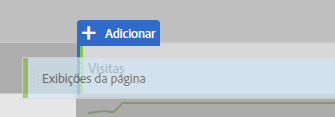
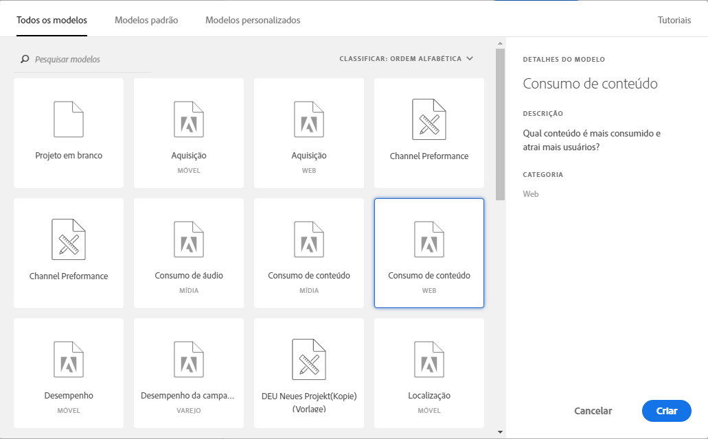

# Criar um relatório básico na Analysis Workspace para usuários do Google Analytics

A Analysis Workspace (um dos recursos principais do Adobe Analytics) fornece uma área robusta para o usuário obter qualquer insight sobre os dados coletados. O relatório é muito diferente entre o Google Analytics e o Adobe Analytics:

* A estrutura de relatórios no Google Analytics permite selecionar um tipo específico de dados, como localização geográfica ou tráfego de referências. A plataforma usa uma exibição de relatório pré-fabricação com base na melhor maneira prevista para exibir esses dados.
* A estrutura de relatórios na Analysis Workspace fornece uma tela em branco, fornecendo mais flexibilidade nas necessidades exatas de relatórios da reunião.

Como a Analysis Workspace funciona mais como uma tela do que os relatórios pré-fabricados, recriar relatórios do Google Analytics é simplesmente uma questão de uso das visualizações e componentes corretos.

## Termos-chave usados na Workspace

* **Os painéis** são os blocos de construção abrangentes do espaço de trabalho. Em quase todos os cenários, um painel de Forma livre é usado.
* **As visualizações** compõem todos os painéis de forma livre. Sua finalidade é representar dados em diferentes formatos. A maioria das vezes que o formato é uma tabela, mas outras vezes pode ser algo como um gráfico de rosca ou linha. Muitos relatórios do Google Analytics são feitos do equivalente a duas visualizações: um gráfico de linha e uma tabela de forma livre.
* **Os componentes** são colocados em uma visualização para retornar dados. Os componentes podem ser misturados de várias formas diferentes para atender às necessidades de relatórios.
   * **As dimensões** são valores variáveis e geralmente contêm texto. Os exemplos incluem nome da página, referenciador ou país geográfico. Eles são listados com mais frequência como linhas em uma tabela.
   * **Normalmente, as métricas** significam um evento ou conversão de alguma classificação. Exemplos incluem eventos comuns, como uma exibição de página, ou algo mais significativo como uma compra ou registro. Eles são vistos como colunas em tabelas para mostrar o número de vezes que o evento ocorreu por dimensão.
   * **Os segmentos** são um subconjunto de seus dados e se comportam de forma semelhante aos segmentos no Google Analytics. Eles permitem que você faça filtros personalizados, permitindo que você se concentre em uma parte específica dos seus dados.
   * **Os intervalos** de datas permitem organizar os dados quando ocorrer um evento. Eles são a dorsal da visualização de tendências ao longo do tempo, e geralmente são pareados com uma métrica.

## Criar um relatório básico no Workspace

Crie um relatório de Todas as páginas (similar ao do Google Analytics), arrastando os componentes certos para uma tela de área de trabalho.

1. Log in to [experiencecloud.adobe.com](https://experiencecloud.adobe.com) using your Adobe ID credentials.
2. Clique no ícone de 9-quadrado na parte superior direita e clique no logotipo colorido do Analytics.
3. Na barra de navegação superior, clique em Espaço de trabalho.
4. Clique no botão «Criar novo projeto».
5. No pop-up modal, verifique se &quot;Projeto em branco&quot; está selecionado e clique em Criar.
6. À esquerda, é mostrada uma lista de dimensões, métricas, segmentos e intervalos de datas. Localize a dimensão Páginas (laranja colorido) e arraste-a para a tela denominada &quot;Soltar uma dimensão aqui&quot;.
7. Um relatório que mostra as principais páginas deste mês pode ser visualizado. Analysis Workspace automatically populates the report with the [Occurrences](../../../components/c-variables/c-metrics/metrics-occurrences.md) metric.
8. Uma tabela no Google Analytics geralmente contém 7-8 métricas. Localize a métrica Taxa de rejeição (verde colorido) e arraste-a ao lado do cabeçalho da métrica Ocorrências. Se você arrastar a métrica Taxa de rejeição ao lado de Ocorrências, ambas as métricas serão exibidas lado a lado.
9. Muitas métricas podem ser colocadas lado a lado arrastando métricas ao lado dos cabeçalhos de métricas existentes. See [commonly used metrics](common-metrics.md) for information on how to obtain metrics typically used in Google Analytics.

   

## Comece com um modelo de relatório pré-integrado no Workspace

Crie o modelo de Consumo de conteúdo (similar ao relatório Todas as páginas no Google Analytics) acessando um modelo de projeto.

1. Clique no botão «Criar novo projeto».
2. Localize e clique duas vezes no ícone «Consumo de conteúdo (Web)» listado em Todos os modelos.
3. Navegue por cada uma das visualizações que foram pré-criadas: Fluxo da página de entrada, Tabela de páginas principais, Fluxo da página de saída, Fluxo de seção do site de entrada e Tabela de seções do site superior.

   

## Teste com a ferramenta

Como a Analysis Workspace é uma ferramenta de relatórios, ela não afeta a coleta de dados. Não há repercussões para arrastar os componentes indiscriminadamente para um projeto para ver o que funciona. Arraste combinações diferentes de dimensões e métricas para o projeto do espaço de trabalho para ver o que está disponível para você.

Se você arrastar acidentalmente um componente inválido para o projeto do espaço de trabalho ou voltar uma etapa, pressione ctrl + Z (Windows) ou cmd + Z (Mac) para desfazer a última ação realizada. You can also start with a clean slate by clicking *[!UICONTROL Project] &gt; [!UICONTROL New]* in the upper left menu.

A Adobe colocou uma grande funcionalidade na Analysis Workspace no menu de contexto com clique direito. A maioria das visualizações e componentes pode ser clicada com o botão direito do mouse para uma análise e interação mais detalhadas. Considere clicar com o botão direito do mouse nos componentes na área de trabalho para ver quais opções estão disponíveis.

## Entender quais dimensões e métricas usar

Se você estiver confortável com a Analysis Workspace e quiser recriar um relatório específico normalmente visualizado no Google Analytics, localize o relatório em sua respectiva página:

* [Relatórios em Tempo real](realtime-reports.md)
* [Relatórios de público-alvo](audience-reports.md)
* [Relatórios de aquisição](acquisition-reports.md)
* [Relatórios de comportamento](behavior-reports.md)
* [Relatórios de conversões](conversions-reports.md)
