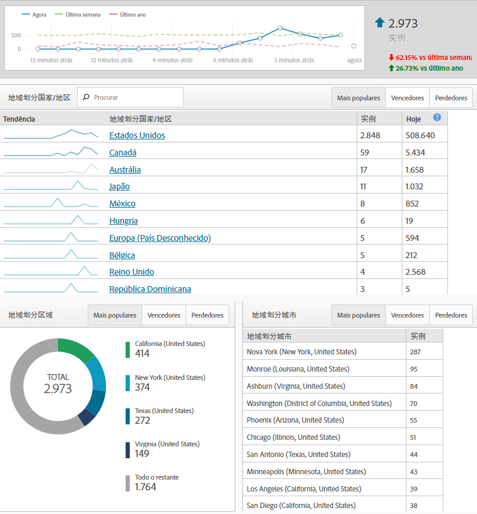
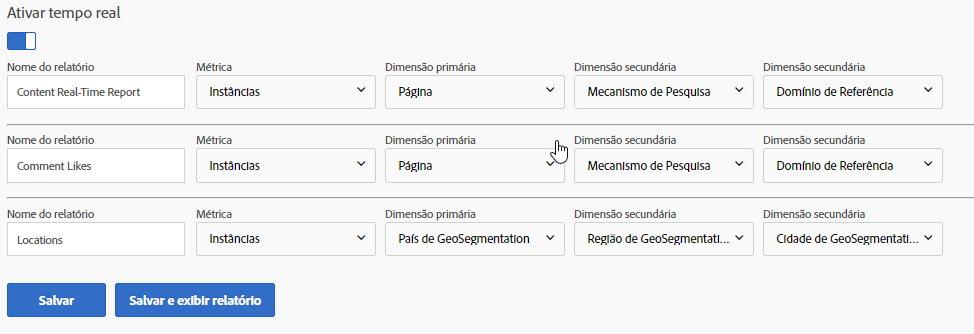

# Relatórios em tempo real

Os relatórios em tempo real mostram o que está acontecendo no site agora. Esses tipos de relatórios são especialmente valiosos para ver os resultados imediatos das atualizações feitas ao site. Por exemplo, uma empresa que realiza uma venda em Black Friday pode medir o tráfego para páginas específicas e determinar quais vendas para priorizar com base no desempenho nesse momento.

Os relatórios em tempo real são um dos poucos recursos que ainda não foram introduzidos na Analysis Workspace. Use Relatórios e análises para obter esses dados. Eles exigem uma configuração simples para começar a coletar dados.

Para chegar à página de configuração de relatório em tempo real (permissões administrativas necessárias):

1. Click [!UICONTROL Reports] in the Adobe Analytics header navigation.
2. In the left menu, Click *[!UICONTROL Site Metrics]* &gt; *[!UICONTROL Real-Time]*.
3. Se o conjunto de relatórios ainda não tiver tempo real, uma mensagem será exibida com um link para configurar o conjunto de relatórios. If the report suite has real-time enabled, click [!UICONTROL Configure] near the real-time report's title.

A Adobe permite até três relatórios em tempo real para coletar dados simultaneamente. Cada um deve ser configurado antes que comece a coletar dados em tempo real.

## Locais em tempo real

Os locais em tempo real informam onde os visitantes residem ao visitar seu site no momento atual. Para configurar um dos três relatórios em tempo real para mostrar os dados de localização:

1. Click [!UICONTROL Configure] near the real-time report's title.
2. Em um dos slots de relatório em tempo real:
   * Dê um nome ao seu relatório em tempo real; por exemplo, «Locais».
   * Normalmente, as instâncias são usadas como métricas. Usuários/Visitantes únicos não estão disponíveis em relatórios em tempo real neste momento.
   * Para Dimensão primária, o País de geosegmentation é normalmente usado. Região de geosegmentation, geosegmentation US DMA e Cidade de geosegmentation também estão disponíveis.
   * Para as duas dimensões secundárias, use os dados adicionais preferidos que você gostaria de ver para este tráfego. Dimensões secundárias não precisam ser específicas para o local.
3. Click [!UICONTROL Save and View Report].

## Fontes de tráfego em tempo real

As fontes de tráfego em tempo real explicam onde os visitantes vieram ao visitar seu site no momento atual. Para configurar um dos três relatórios em tempo real para mostrar os dados das fontes de tráfego:

1. Clique em'Configurar'próximo ao título do relatório em tempo real.
2. Em um dos slots de relatório em tempo real:
   * Dê um nome ao seu relatório em tempo real; por exemplo, "Fontes de tráfego".
   * Normalmente, as instâncias são usadas como métricas. Usuários/Visitantes únicos não estão disponíveis em relatórios em tempo real neste momento.
   * Para Dimensão principal, o Domínio de referência normalmente é usado. Mecanismo de pesquisa e Palavra-chave de pesquisa também estão disponíveis.
   * Para as duas dimensões secundárias, use os dados adicionais preferidos que você gostaria de ver para este tráfego. As dimensões secundárias não precisam ser específicas para fontes de tráfego.
3. Click [!UICONTROL Save and View Report].

## Conteúdo em tempo real

O conteúdo em tempo real informa quais páginas seus visitantes estão visualizando atualmente. Para configurar um dos três relatórios em tempo real para mostrar os dados do conteúdo:

1. Click [!UICONTROL Configure] near the real-time report's title.
2. Em um dos slots de relatório em tempo real:
   * Dê um nome ao seu relatório em tempo real; por exemplo, "Conteúdo".
   * Normalmente, as instâncias são usadas como métricas. Usuários/Visitantes únicos não estão disponíveis em relatórios em tempo real neste momento.
   * Para Dimensão principal, a página é normalmente usada. A Seção do site e o Servidor também estarão disponíveis se a implementação definir essas variáveis.
   * Para as duas dimensões secundárias, use os dados adicionais preferidos que você gostaria de ver para este tráfego. Dimensões secundárias não precisam ser específicas para o conteúdo.
3. Click [!UICONTROL Save and View Report].

## Eventos em tempo real

Os eventos em tempo real informam quais eventos estão acontecendo mais no site. No Google Analytics, um evento captura o número de vezes que uma ação específica (geralmente uma ação que não está relacionada a uma exibição de página) ocorreu. Os eventos GA são enviados com uma categoria, rótulo e ação. No Adobe Analytics, os eventos personalizados são métricas que recebem nomes amigáveis no console de administração e podem ser analisados junto com qualquer dimensão. Se estiver procurando por uma dimensão no Adobe Analytics semelhante aos eventos do Google Analytics, considere aplicar a dimensão Link personalizado, que é usada frequentemente como um catch-all para coletar dados que não estão relacionados a exibições de página (além de Links de saída - para Saídas - e Links de download - para Downloads).

> [!NOTE] Ao usar eventos personalizados em relatórios em tempo real, o valor da dimensão deve ser definido na mesma ocorrência que o evento personalizado. Por exemplo, se exibir um evento personalizado "Registros" para a dimensão "Domínio de referência", nenhum dado seria retornado sem uma implementação adicional. Como o domínio de referência aparece somente na primeira ocorrência e um evento personalizado normalmente aparece mais tarde na visita, os dados não podem ser associados em relatórios em tempo real. Esses dados estão disponíveis usando a Analysis Workspace usando a latência padrão de processamento, que normalmente é de 30a 90 minutos.

## Conversões em tempo real

As conversões em tempo real apresentam dados de forma diferente entre plataformas. Os objetivos no Google Analytics estão acinzentados e eventos bem-sucedidos no Adobe Analytics. Você pode usar a maioria das métricas no Adobe Analytics (métricas personalizadas como eventos bem-sucedidos e métricas padrão, como receita) em Relatórios em tempo real. Assim como o Google Analytics, você também pode aplicar dimensões como nome do produto, código de rastreamento e desempenho da campanha em relatórios em tempo real.

1. Click [!UICONTROL Configure] near the real-time report's title.
2. Em um dos slots de relatório em tempo real:
   * Dê um nome ao seu relatório em tempo real; por exemplo, "Conversões".
   * Normalmente, as instâncias são usadas como métricas. Usuários/Visitantes únicos não estão disponíveis em relatórios em tempo real neste momento.
   * Para Dimensão principal, o Código de rastreamento normalmente é usado. A dimensão Produtos também está disponível se sua implementação o usa.
   * Para as duas dimensões secundárias, use os dados adicionais preferidos que você gostaria de ver para este tráfego. As dimensões secundárias não precisam ser específicas para conversões.
3. Click [!UICONTROL Save and View Report].

> [!NOTE] Se estiver usando eventos fora de Instâncias, como Pedidos, certifique-se de que sua implementação define a dimensão e o evento na mesma ocorrência. Se as dimensões e os eventos não forem acionados na mesma ocorrência, esses dados estarão disponíveis na Analysis Workspace usando a latência padrão de processamento, que normalmente é de 30a 90 minutos.
